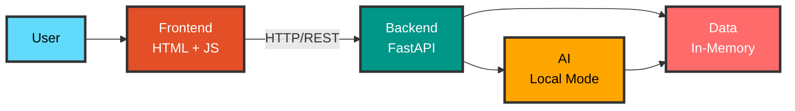
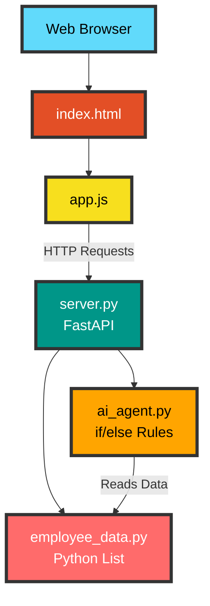
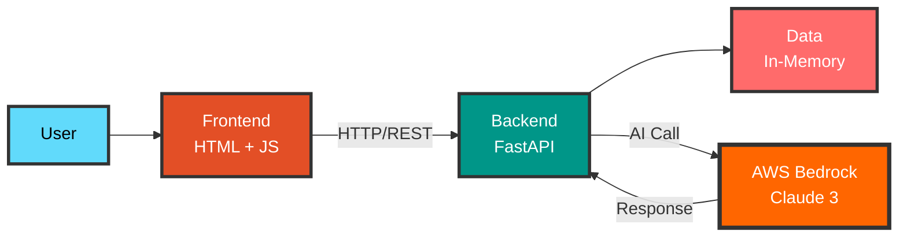
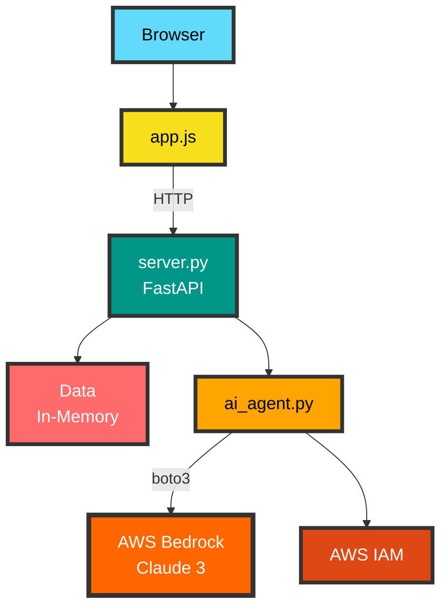

# System Architecture - Progressive Evolution

This document presents the system architecture and its evolution through different demos.

## Table of Contents

- [Current Architecture (Demo 1)](#current-architecture-demo-1)
- [Evolution Level 2: AWS Bedrock](#evolution-level-2-aws-bedrock)
- [Evolution Level 3: Persistence](#evolution-level-3-persistence)
- [Evolution Level 4: Authentication](#evolution-level-4-authentication)
- [Evolution Level 5: Advanced Features](#evolution-level-5-advanced-features)
- [Evolution Level 6: Advanced AI](#evolution-level-6-advanced-ai)
- [Evolution Level 7: Production](#evolution-level-7-production)
- [Final Architecture (Demo 19B)](#final-architecture-demo-19b)

---

## Current Architecture (Demo 1)

**Repository**: [awsbedrock-demo-1-inmemory](https://github.com/inskillflow/awsbedrock-demo-1-inmemory)

### Description

Simple system with REST API, web interface, and local AI mode. All data is in-memory.

### Architecture Diagram - Simplified View

### Detailed Architecture

### Components

| Component | Technology | Status | Notes |
|-----------|------------|--------|-------|
| Frontend | HTML5 + JavaScript | ✅ Current | Responsive web interface |
| REST API | FastAPI | ✅ Current | Complete CRUD endpoints |
| Data | Python Lists | ⚠️ Temporary | In-memory, non-persistent |
| AI | Local Mode | ⚠️ Basic | Simple rules, not real AI |

### Limitations

- ❌ No persistence (data lost on restart)
- ❌ Basic AI (local mode with rules)
- ❌ No authentication
- ❌ No file management

---

## Evolution Level 2: AWS Bedrock

**Repository**: [awsbedrock-demo-2-aws-bedrock-real](https://github.com/inskillflow/awsbedrock-demo-2-aws-bedrock-real)

### Additions

- Complete AWS configuration
- Real AI with Claude 3 Sonnet
- Secured AWS credentials

### Architecture Diagram - Simplified View

### Detailed Architecture

### New Components

| Component | Technology | Addition | Notes |
|-----------|------------|----------|-------|
| AWS Bedrock | Claude 3 Sonnet | ✅ Demo 2 | Real and powerful AI |
| AWS IAM | Credentials | ✅ Demo 2 | Security and permissions |
| Boto3 | Python SDK | ✅ Demo 2 | AWS Client |

---

**Author**: Haythem REHOUMA - Gneurone Inc.  
**Contact**: contact@gneuroneai.com  
**GitHub**: https://github.com/inskillflow

