# System Architecture - Progressive Evolution

This document presents the system architecture and its evolution through different demos.

## Table of Contents

- [Current Architecture (Demo 1)](#current-architecture-demo-1)
- [Evolution Level 2: AWS Bedrock](#evolution-level-2-aws-bedrock)
- [Evolution Level 3: Persistence](#evolution-level-3-persistence)
- [Evolution Level 4: Authentication](#evolution-level-4-authentication)
- [Evolution Level 5: Advanced Features](#evolution-level-5-advanced-features)
- [Evolution Level 6: Advanced AI](#evolution-level-6-advanced-ai)
- [Evolution Level 7: Production](#evolution-level-7-production)
- [Final Architecture (Demo 19B)](#final-architecture-demo-19b)

---

## Current Architecture (Demo 1)

**Repository**: [awsbedrock-demo-1-inmemory](https://github.com/inskillflow/awsbedrock-demo-1-inmemory)

### Description

Simple system with REST API, web interface, and local AI mode. All data is in-memory.

### Architecture Diagram - Simplified View

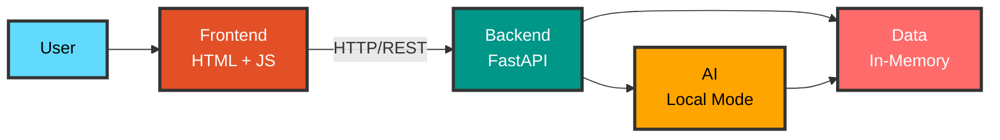

### Detailed Architecture

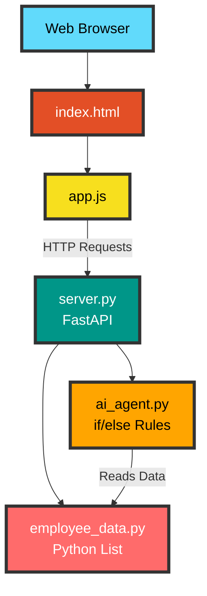

### Components

| Component | Technology | Status | Notes |
|-----------|------------|--------|-------|
| Frontend | HTML5 + JavaScript | ✅ Current | Responsive web interface |
| REST API | FastAPI | ✅ Current | Complete CRUD endpoints |
| Data | Python Lists | ⚠️ Temporary | In-memory, non-persistent |
| AI | Local Mode | ⚠️ Basic | Simple rules, not real AI |

### Limitations

- ❌ No persistence (data lost on restart)
- ❌ Basic AI (local mode with rules)
- ❌ No authentication
- ❌ No file management

---

## Evolution Level 2: AWS Bedrock

**Repository**: [awsbedrock-demo-2-aws-bedrock-real](https://github.com/inskillflow/awsbedrock-demo-2-aws-bedrock-real)

### Additions

- Complete AWS configuration
- Real AI with Claude 3 Sonnet
- Secured AWS credentials

### Architecture Diagram - Simplified View

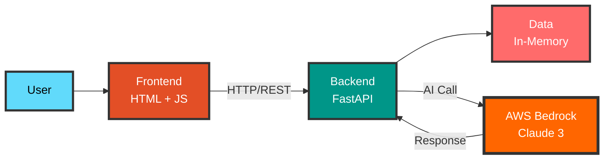

### Detailed Architecture

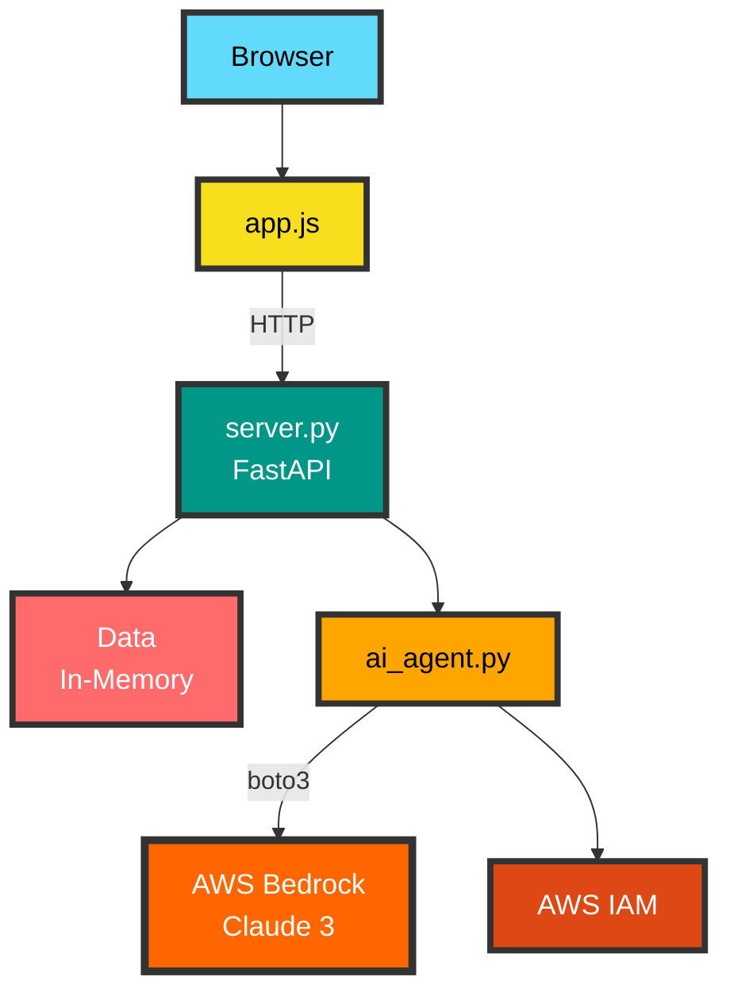

### New Components

| Component | Technology | Addition | Notes |
|-----------|------------|----------|-------|
| AWS Bedrock | Claude 3 Sonnet | ✅ Demo 2 | Real and powerful AI |
| AWS IAM | Credentials | ✅ Demo 2 | Security and permissions |
| Boto3 | Python SDK | ✅ Demo 2 | AWS Client |

---

## Evolution Level 3: Persistence

**Repositories**: 
- [awsbedrock-demo-3-postgresql](https://github.com/inskillflow/awsbedrock-demo-3-postgresql)
- [awsbedrock-demo-4-xata](https://github.com/inskillflow/awsbedrock-demo-4-xata)

### Additions

- PostgreSQL database (Neon)
- SQLAlchemy ORM
- Alembic migrations
- Alternative: Xata

### Architecture Diagram - Simplified View

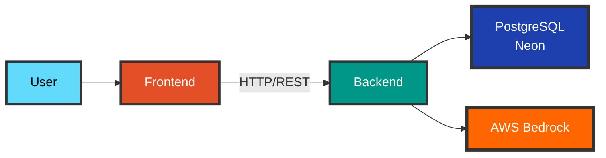

### Detailed Architecture

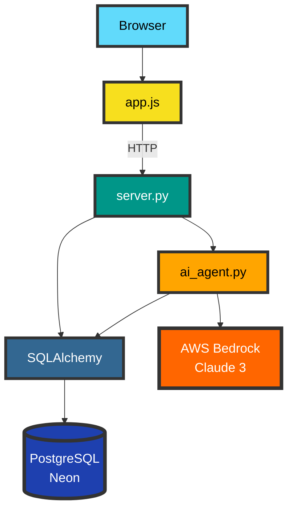

### New Components

| Component | Technology | Addition | Notes |
|-----------|------------|----------|-------|
| PostgreSQL | Neon Serverless | ✅ Demo 3 | Persistent database |
| ORM | SQLAlchemy | ✅ Demo 3 | Object-relational mapping |
| Migrations | Alembic | ✅ Demo 3 | Schema management |
| Alternative DB | Xata | ✅ Demo 4 | Modern database with search |

---

## Evolution Level 4: Authentication

**Repositories**:
- [awsbedrock-demo-5a-auth-clerk](https://github.com/inskillflow/awsbedrock-demo-5a-auth-clerk)
- [awsbedrock-demo-5b-auth-jwt-custom](https://github.com/inskillflow/awsbedrock-demo-5b-auth-jwt-custom)
- [awsbedrock-demo-6-rbac](https://github.com/inskillflow/awsbedrock-demo-6-rbac)

### Additions

- Authentication (Clerk or JWT)
- Session management
- Roles and permissions (RBAC)
- Endpoint protection

### Architecture Diagram - Simplified View

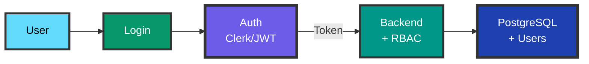

### Detailed Architecture

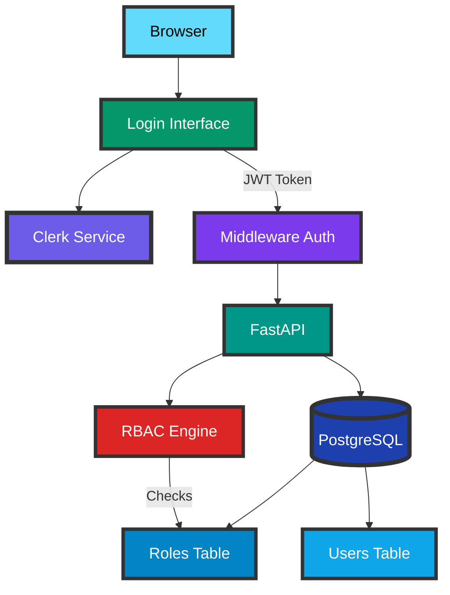

### New Components

| Component | Technology | Addition | Notes |
|-----------|------------|----------|-------|
| Auth Service | Clerk | ✅ Demo 5A | Quick auth (15 min) |
| Custom JWT | python-jose | ✅ Demo 5B | JWT from scratch |
| RBAC | Custom | ✅ Demo 6 | Role management |
| Middleware | FastAPI | ✅ Demo 5 | Endpoint protection |

---

## Evolution Level 5: Advanced Features

**Repositories**:
- [awsbedrock-demo-7-files-s3](https://github.com/inskillflow/awsbedrock-demo-7-files-s3)
- [awsbedrock-demo-8-notifications](https://github.com/inskillflow/awsbedrock-demo-8-notifications)
- [awsbedrock-demo-9a-stripe](https://github.com/inskillflow/awsbedrock-demo-9a-stripe)
- [awsbedrock-demo-9b-exports](https://github.com/inskillflow/awsbedrock-demo-9b-exports)

### Additions

- File upload to S3
- Notifications and emails
- Stripe subscriptions
- PDF/Excel exports

### Architecture Diagram

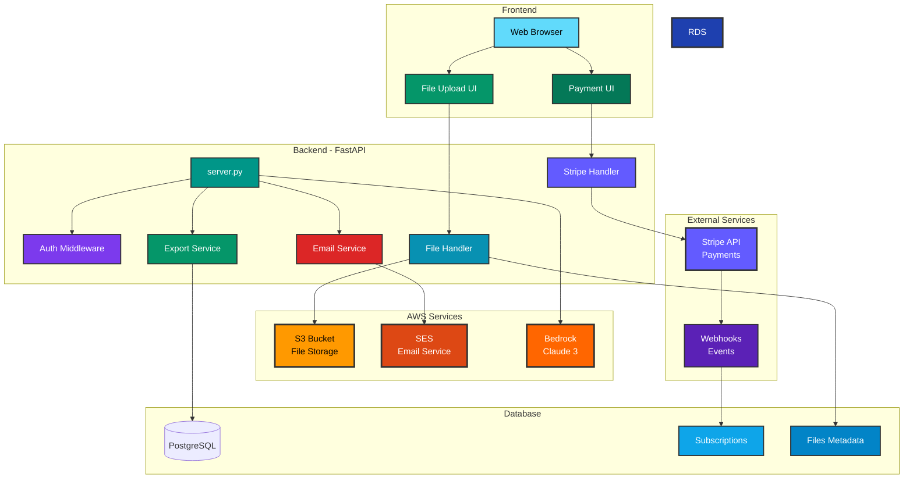

### New Components

| Component | Technology | Addition | Notes |
|-----------|------------|----------|-------|
| S3 Storage | AWS S3 | ✅ Demo 7 | File storage |
| Email | AWS SES | ✅ Demo 8 | Email notifications |
| Payments | Stripe | ✅ Demo 9A | SaaS subscriptions |
| Exports | reportlab/openpyxl | ✅ Demo 9B | PDF, Excel, CSV |

---

## Evolution Level 6: Advanced AI

**Repositories**:
- [awsbedrock-demo-10-rag-pgvector](https://github.com/inskillflow/awsbedrock-demo-10-rag-pgvector)
- [awsbedrock-demo-11-chat-history](https://github.com/inskillflow/awsbedrock-demo-11-chat-history)
- [awsbedrock-demo-11b-agentic-ai](https://github.com/inskillflow/awsbedrock-demo-11b-agentic-ai)

### Additions

- RAG with pgvector
- Vector embeddings
- Conversation history
- Multi-agent system

### Architecture Diagram

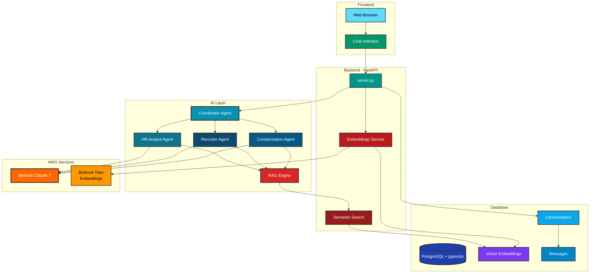

### New Components

| Component | Technology | Addition | Notes |
|-----------|------------|----------|-------|
| pgvector | PostgreSQL Extension | ✅ Demo 10 | Vector database |
| RAG | LangChain | ✅ Demo 10 | Semantic search |
| Embeddings | AWS Bedrock Titan | ✅ Demo 10 | Text vectorization |
| Chat History | SQLAlchemy | ✅ Demo 11 | Conversations |
| Multi-Agents | LangGraph | ✅ Demo 11B | Agent orchestration |

---

## Evolution Level 7: Production

**Repositories**:
- [awsbedrock-demo-12-docker](https://github.com/inskillflow/awsbedrock-demo-12-docker)
- [awsbedrock-demo-13-cicd](https://github.com/inskillflow/awsbedrock-demo-13-cicd)
- [awsbedrock-demo-14-aws-deployment](https://github.com/inskillflow/awsbedrock-demo-14-aws-deployment)
- [awsbedrock-demo-15-monitoring](https://github.com/inskillflow/awsbedrock-demo-15-monitoring)

### Additions

- Docker containerization
- CI/CD Pipeline
- AWS ECS deployment
- Monitoring and logs

### Architecture Diagram

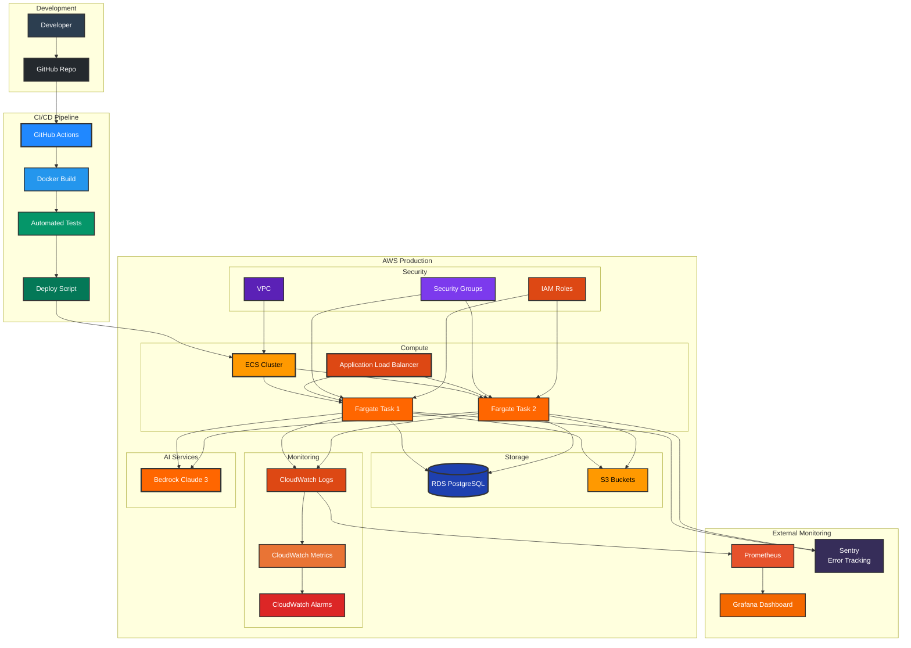

### New Components

| Component | Technology | Addition | Notes |
|-----------|------------|----------|-------|
| Docker | Containerization | ✅ Demo 12 | Docker images |
| CI/CD | GitHub Actions | ✅ Demo 13 | Automated pipeline |
| ECS | AWS Fargate | ✅ Demo 14 | Container orchestration |
| Load Balancer | AWS ALB | ✅ Demo 14 | Load distribution |
| Monitoring | CloudWatch + Grafana | ✅ Demo 15 | Observability |
| Error Tracking | Sentry | ✅ Demo 15 | Error tracking |

---

## Final Architecture (Demo 19B)

**Repository**: [awsbedrock-demo-19b-react-app](https://github.com/inskillflow/awsbedrock-demo-19b-react-app)

### Ultra-Simplified Overview

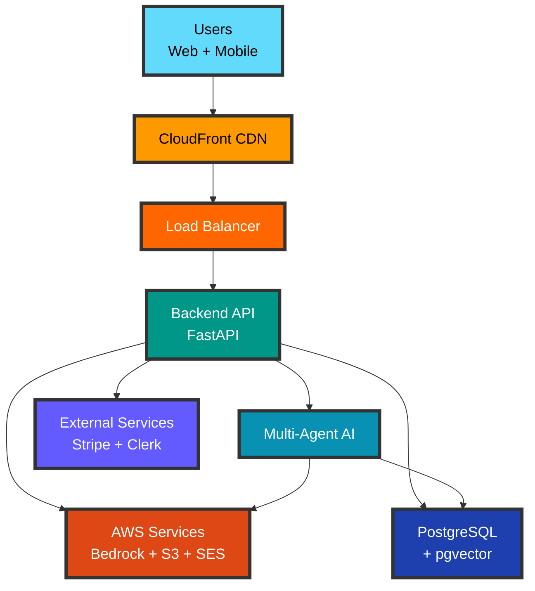

### Diagram 1: Frontend → Backend Flow

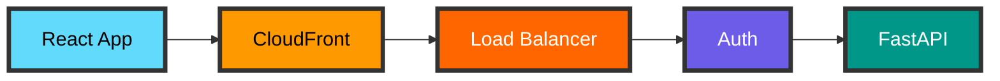

### Diagram 2: Backend → Database

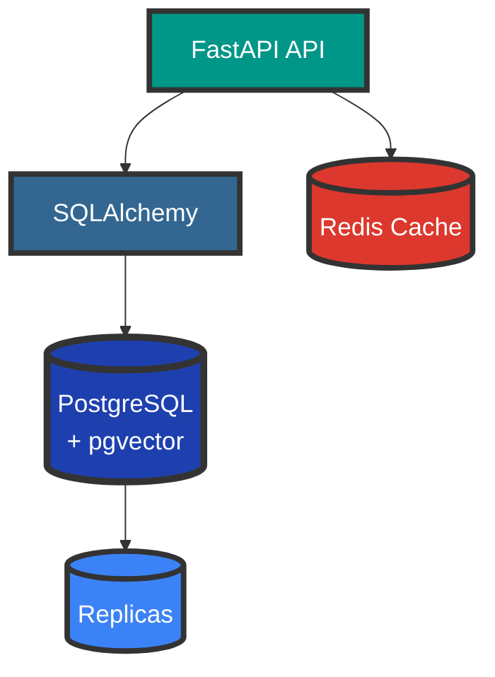

### Diagram 3: Multi-Agent AI System

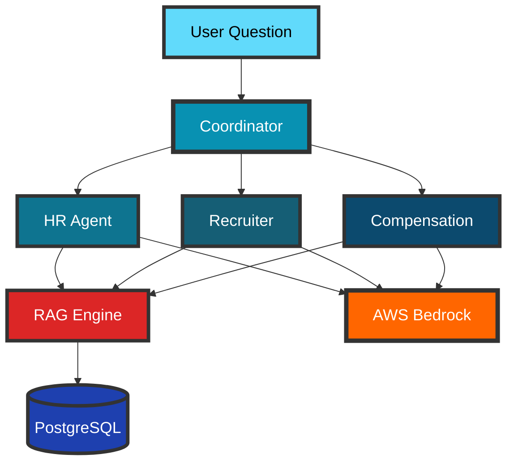

### Diagram 4: External Services

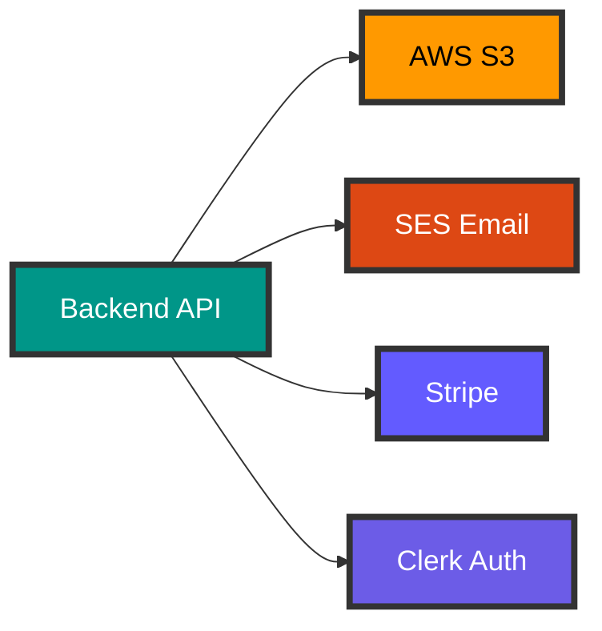

### Diagram 5: CI/CD Deployment

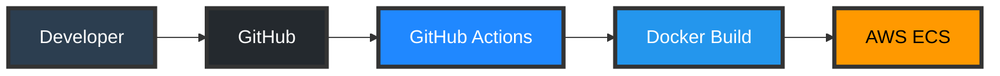

### Diagram 6: Monitoring

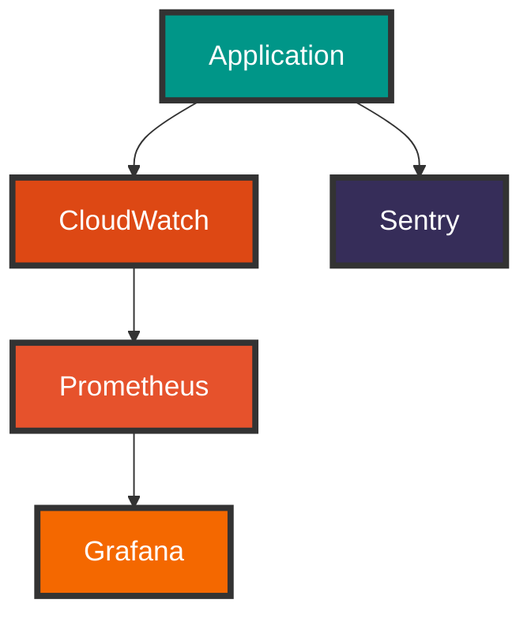

### Enterprise Architecture - Simplified Diagrams

#### Diagram 7A: Multi-Tenant (Data Isolation)

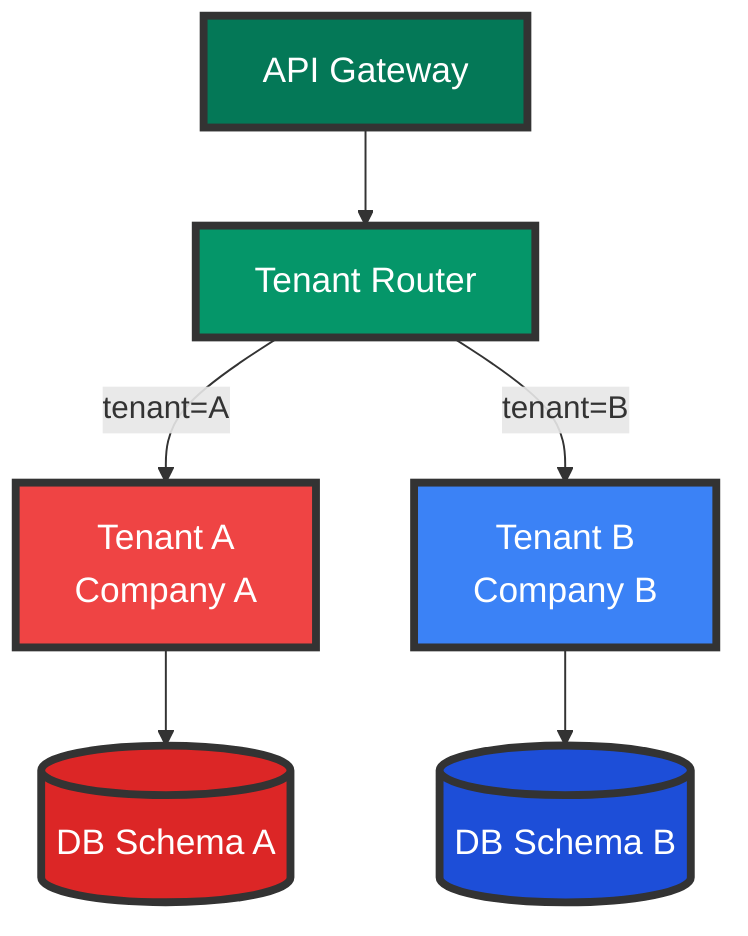

#### Diagram 7B: Microservices

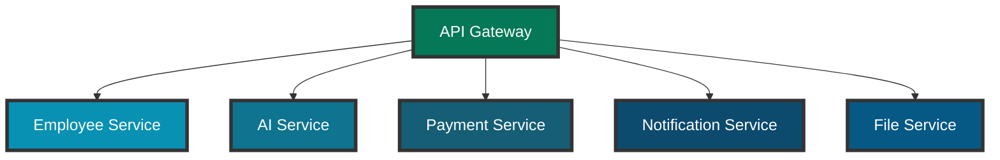

#### Diagram 7C: Message Queue (Asynchronous Tasks)

```mermaid
flowchart LR
    Services[Services]
    Queue[Message Queue<br/>SQS/RabbitMQ]
    EventBus[Event Bus]
    Workers[Background Workers]
    
    Services --> Queue
    Queue --> EventBus
    EventBus --> Workers
    
    style Services fill:#009688,stroke:#333,stroke-width:4px,color:#fff,font-size:18px
    style Queue fill:#F59E0B,stroke:#333,stroke-width:4px,color:#000,font-size:18px
    style EventBus fill:#D97706,stroke:#333,stroke-width:4px,color:#fff,font-size:18px
    style Workers fill:#B45309,stroke:#333,stroke-width:4px,color:#fff,font-size:18px
```

#### Diagram 7D: Security

```mermaid
flowchart TD
    Internet[Internet]
    WAF[WAF<br/>Firewall]
    Shield[AWS Shield<br/>DDoS]
    App[Application]
    Secrets[Secrets Manager]
    KMS[KMS Encryption]
    
    Internet --> WAF
    WAF --> Shield
    Shield --> App
    App --> Secrets
    App --> KMS
    
    style Internet fill:#61DAFB,stroke:#333,stroke-width:4px,color:#000,font-size:18px
    style WAF fill:#DC2626,stroke:#333,stroke-width:5px,color:#fff,font-size:18px
    style Shield fill:#991B1B,stroke:#333,stroke-width:4px,color:#fff,font-size:18px
    style App fill:#009688,stroke:#333,stroke-width:4px,color:#fff,font-size:18px
    style Secrets fill:#7C3AED,stroke:#333,stroke-width:4px,color:#fff,font-size:18px
    style KMS fill:#5B21B6,stroke:#333,stroke-width:4px,color:#fff,font-size:18px
```

### Complete Technology Stack

| Layer | Technologies | Demos |
|-------|--------------|-------|
| **Frontend** | React, TypeScript, Redux, TailwindCSS, Storybook | 19A, 19B |
| **Backend** | FastAPI, Python, Pydantic | 1-19 |
| **Auth** | Clerk, JWT, OAuth2 | 5A, 5B, 6 |
| **Database** | PostgreSQL, pgvector, Neon/Xata | 3, 4, 10 |
| **Caching** | Redis, ElastiCache | 12, 14 |
| **AI** | AWS Bedrock (Claude 3, Titan), LangChain, LangGraph | 2, 10, 11B |
| **Storage** | AWS S3 | 7 |
| **Payments** | Stripe | 9A |
| **Email** | AWS SES, SendGrid | 8 |
| **Notifications** | AWS SNS, Push | 8, 18B |
| **Exports** | reportlab, openpyxl, pandas | 9B |
| **Container** | Docker, Docker Compose | 12 |
| **Orchestration** | AWS ECS, Fargate | 14 |
| **CI/CD** | GitHub Actions, Terraform | 13, 14 |
| **Monitoring** | CloudWatch, Grafana, Prometheus, Sentry | 15 |
| **Load Balancer** | AWS ALB, CloudFront | 14 |
| **Security** | WAF, Shield, KMS, Secrets Manager | 14, 16 |
| **API** | REST, OpenAPI, Rate Limiting | 17 |
| **Documentation** | MkDocs, Sphinx, Storybook | 18A, 19A |

---

## Data Evolution

### Demo 1: In-Memory

```python
# employee_data.py
EMPLOYEES = [
    {"id": 1, "name": "Alice", ...}
]
```

### Demo 3: PostgreSQL

```sql
CREATE TABLE employees (
    id SERIAL PRIMARY KEY,
    name VARCHAR(255),
    email VARCHAR(255) UNIQUE,
    ...
);
```

### Demo 10: + pgvector

```sql
CREATE EXTENSION vector;

ALTER TABLE employees 
ADD COLUMN embedding vector(1536);

CREATE INDEX ON employees 
USING ivfflat (embedding vector_cosine_ops);
```

### Demo 16: Multi-tenant

```sql
CREATE SCHEMA tenant_a;
CREATE SCHEMA tenant_b;

CREATE TABLE tenant_a.employees (...);
CREATE TABLE tenant_b.employees (...);
```

---

## Data Flows

### Simple Flow (Demo 1-3)

```
User → Frontend → API → Data → Database
```

### Flow with AI (Demo 10)

```
User → Frontend → API → AI Agent → RAG Engine → pgvector → Database
                                  → AWS Bedrock → Response
```

### Multi-Agent Flow (Demo 11B)

```
User Question
    ↓
Coordinator Agent
    ↓
├─→ HR Analyst Agent ─→ RAG ─→ Bedrock ─→ Response 1
├─→ Recruiter Agent ─→ RAG ─→ Bedrock ─→ Response 2
└─→ Compensation Agent ─→ RAG ─→ Bedrock ─→ Response 3
    ↓
Aggregated Response
    ↓
User
```

### Complete Flow with Webhooks (Demo 9A)

```
User → Payment UI → Stripe API
                      ↓
                   Webhook
                      ↓
                   Backend API
                      ↓
                 Update Subscription
                      ↓
                   Send Email (SES)
                      ↓
                   Update UI
```

---

## Scalability

### Horizontal Scaling

```mermaid
graph LR
    subgraph "Load Balancer"
        ALB[ALB]
    end
    
    subgraph "Auto Scaling Group"
        App1[App Instance 1]
        App2[App Instance 2]
        App3[App Instance 3]
        AppN[App Instance N]
    end
    
    subgraph "Database"
        Primary[(Primary DB)]
        Replica1[(Replica 1)]
        Replica2[(Replica 2)]
    end
    
    subgraph "Cache"
        Redis[(Redis Cluster)]
    end
    
    ALB --> App1
    ALB --> App2
    ALB --> App3
    ALB --> AppN
    
    App1 --> Redis
    App2 --> Redis
    App3 --> Redis
    AppN --> Redis
    
    App1 --> Primary
    App2 --> Primary
    App3 --> Primary
    AppN --> Primary
    
    Primary --> Replica1
    Primary --> Replica2
    
    App1 -.read.-> Replica1
    App2 -.read.-> Replica1
    App3 -.read.-> Replica2
    AppN -.read.-> Replica2
```

---

## Security by Layer

| Layer | Security Mechanisms | Demos |
|-------|---------------------|-------|
| **Frontend** | HTTPS, CORS, CSP, XSS Protection | 1-19 |
| **API** | JWT, OAuth2, Rate Limiting | 5A, 5B, 17 |
| **Application** | RBAC, Input Validation, SQL Injection Protection | 6 |
| **Network** | VPC, Security Groups, Private Subnets | 14 |
| **Data** | Encryption at Rest (KMS), Encryption in Transit (TLS) | 14, 16 |
| **Secrets** | AWS Secrets Manager, Environment Variables | 14 |
| **DDoS** | AWS Shield, WAF, CloudFront | 14 |
| **Monitoring** | CloudWatch Alarms, Sentry Alerts | 15 |

---

## Estimated Costs by Architecture

| Architecture | Monthly Cost | Users | Notes |
|--------------|--------------|-------|-------|
| Demo 1 (Local) | $0 | Development | Free |
| Demo 2 (+ AWS Bedrock) | $30-50 | Testing | Real AI |
| Demo 3 (+ Neon) | $30-50 | < 100 | Neon free tier |
| Demo 14 (Production) | $200-500 | 1000 | ECS + RDS + Bedrock |
| Demo 16 (Multi-tenant) | $500-2000 | 10,000 | Scale |
| Demo 19 (Enterprise) | $2000-5000 | 100,000 | Full scale |

---

## Performance Metrics

### Targets by Level

| Metric | Demo 1-3 | Demo 14 | Demo 19 |
|--------|----------|---------|---------|
| Response Time | < 1s | < 500ms | < 200ms |
| Availability | 95% | 99.5% | 99.9% |
| Concurrent Users | 10 | 1,000 | 100,000 |
| Requests/sec | 10 | 1,000 | 10,000 |
| Database Size | 1 MB | 10 GB | 1 TB |

---

## Evolution Summary

```mermaid
timeline
    title Architecture Evolution
    section Foundations
        Demo 1 : REST API + Local AI + Memory
    section Cloud
        Demo 2 : Real AWS Bedrock
    section Persistence
        Demo 3-4 : PostgreSQL / Xata
    section Security
        Demo 5-6 : Auth + RBAC
    section Features
        Demo 7-9 : S3 + Emails + Stripe + Exports
    section Advanced AI
        Demo 10-11 : RAG + pgvector + Multi-Agents
    section Production
        Demo 12-15 : Docker + CI/CD + AWS + Monitoring
    section Enterprise
        Demo 16-19 : Multi-tenant + Public API + React
```

---

**Author**: Haythem REHOUMA - Gneurone Inc.  
**Contact**: contact@gneuroneai.com  
**GitHub**: https://github.com/inskillflow
