# Architecture du Système - Évolution Progressive

Ce document présente l'architecture du système et son évolution à travers les différents demos.

## Table des matières

- [Architecture Actuelle (Demo 1)](#architecture-actuelle-demo-1)
- [Évolution Niveau 2 : AWS Bedrock](#évolution-niveau-2--aws-bedrock)
- [Évolution Niveau 3 : Persistance](#évolution-niveau-3--persistance)
- [Évolution Niveau 4 : Authentification](#évolution-niveau-4--authentification)
- [Évolution Niveau 5 : Fonctionnalités Avancées](#évolution-niveau-5--fonctionnalités-avancées)
- [Évolution Niveau 6 : IA Avancée](#évolution-niveau-6--ia-avancée)
- [Évolution Niveau 7 : Production](#évolution-niveau-7--production)
- [Architecture Finale (Demo 19B)](#architecture-finale-demo-19b)

---

## Architecture Actuelle (Demo 1)

**Repository** : [awsbedrock-demo-1-inmemory](https://github.com/inskillflow/awsbedrock-demo-1-inmemory)

### Description

Système simple avec API REST, interface web, et IA en mode local. Toutes les données sont en mémoire.

### Diagramme d'Architecture - Vue Simplifiée

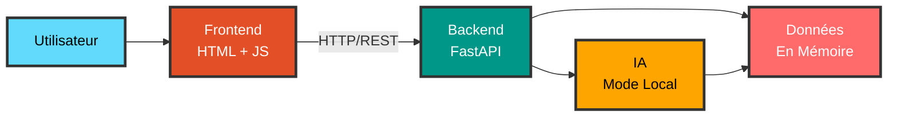

### Architecture Détaillée

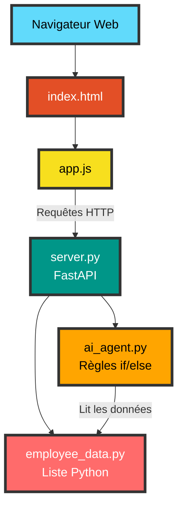

### Composants

| Composant | Technologie | Statut | Notes |
|-----------|-------------|--------|-------|
| Frontend | HTML5 + JavaScript | ✅ Actuel | Interface web responsive |
| API REST | FastAPI | ✅ Actuel | Endpoints CRUD complets |
| Données | Python Lists | ⚠️ Temporaire | En mémoire, non persistant |
| IA | Mode Local | ⚠️ Basique | Règles simples, pas de vraie IA |

### Limitations

- ❌ Pas de persistance (données perdues au redémarrage)
- ❌ IA basique (mode local avec règles)
- ❌ Pas d'authentification
- ❌ Pas de gestion de fichiers

---

## Évolution Niveau 2 : AWS Bedrock

**Repository** : [awsbedrock-demo-2-aws-bedrock-real](https://github.com/inskillflow/awsbedrock-demo-2-aws-bedrock-real)

### Ajouts

- Configuration AWS complète
- IA réelle avec Claude 3 Sonnet
- Credentials AWS sécurisés

### Diagramme d'Architecture - Vue Simplifiée

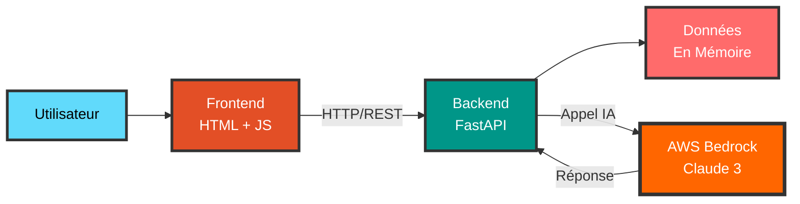

### Architecture Détaillée

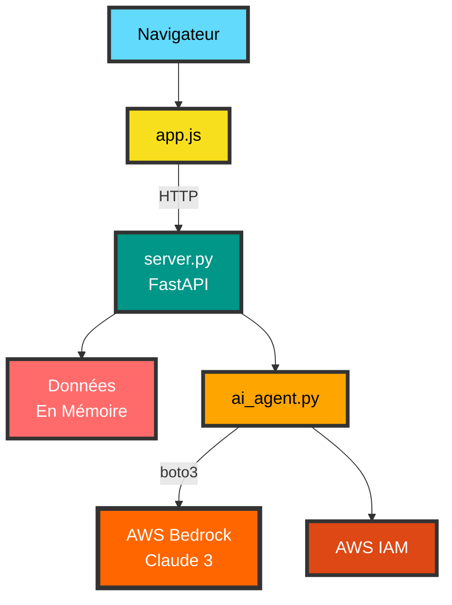

### Nouveaux Composants

| Composant | Technologie | Ajout | Notes |
|-----------|-------------|-------|-------|
| AWS Bedrock | Claude 3 Sonnet | ✅ Demo 2 | IA réelle et puissante |
| AWS IAM | Credentials | ✅ Demo 2 | Sécurité et permissions |
| Boto3 | SDK Python | ✅ Demo 2 | Client AWS |

---

## Évolution Niveau 3 : Persistance

**Repositories** : 
- [awsbedrock-demo-3-postgresql](https://github.com/inskillflow/awsbedrock-demo-3-postgresql)
- [awsbedrock-demo-4-xata](https://github.com/inskillflow/awsbedrock-demo-4-xata)

### Ajouts

- Base de données PostgreSQL (Neon)
- ORM SQLAlchemy
- Migrations Alembic
- Alternative : Xata

### Diagramme d'Architecture - Vue Simplifiée

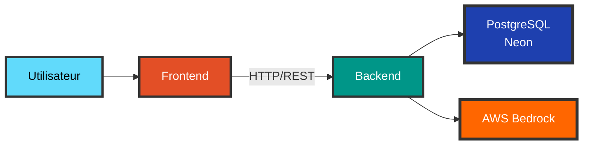

### Architecture Détaillée

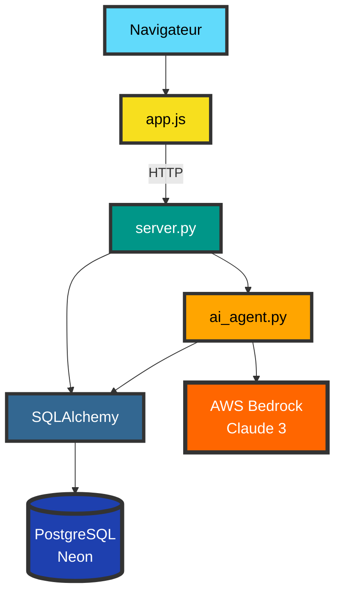

### Nouveaux Composants

| Composant | Technologie | Ajout | Notes |
|-----------|-------------|-------|-------|
| PostgreSQL | Neon Serverless | ✅ Demo 3 | Base de données persistante |
| ORM | SQLAlchemy | ✅ Demo 3 | Mapping objet-relationnel |
| Migrations | Alembic | ✅ Demo 3 | Gestion du schéma |
| Alternative DB | Xata | ✅ Demo 4 | Base moderne avec recherche |

---

## Évolution Niveau 4 : Authentification

**Repositories** :
- [awsbedrock-demo-5a-auth-clerk](https://github.com/inskillflow/awsbedrock-demo-5a-auth-clerk)
- [awsbedrock-demo-5b-auth-jwt-custom](https://github.com/inskillflow/awsbedrock-demo-5b-auth-jwt-custom)
- [awsbedrock-demo-6-rbac](https://github.com/inskillflow/awsbedrock-demo-6-rbac)

### Ajouts

- Authentification (Clerk ou JWT)
- Gestion des sessions
- Rôles et permissions (RBAC)
- Protection des endpoints

### Diagramme d'Architecture - Vue Simplifiée

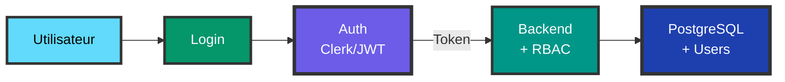

### Architecture Détaillée

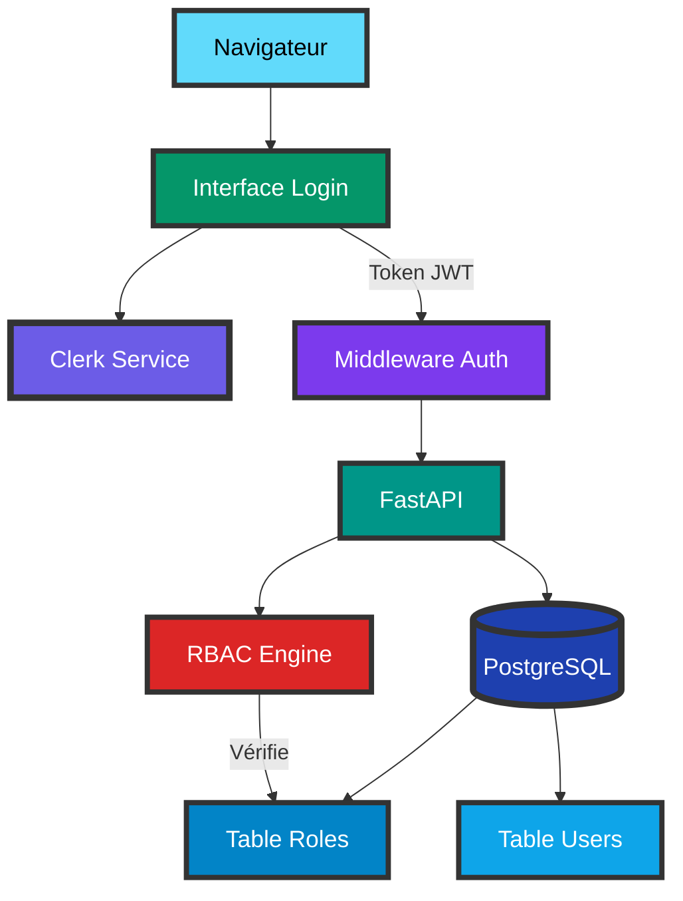

### Nouveaux Composants

| Composant | Technologie | Ajout | Notes |
|-----------|-------------|-------|-------|
| Auth Service | Clerk | ✅ Demo 5A | Auth rapide (15 min) |
| JWT Custom | python-jose | ✅ Demo 5B | JWT from scratch |
| RBAC | Custom | ✅ Demo 6 | Gestion des rôles |
| Middleware | FastAPI | ✅ Demo 5 | Protection endpoints |

---

## Évolution Niveau 5 : Fonctionnalités Avancées

**Repositories** :
- [awsbedrock-demo-7-files-s3](https://github.com/inskillflow/awsbedrock-demo-7-files-s3)
- [awsbedrock-demo-8-notifications](https://github.com/inskillflow/awsbedrock-demo-8-notifications)
- [awsbedrock-demo-9a-stripe](https://github.com/inskillflow/awsbedrock-demo-9a-stripe)
- [awsbedrock-demo-9b-exports](https://github.com/inskillflow/awsbedrock-demo-9b-exports)

### Ajouts

- Upload de fichiers vers S3
- Notifications et emails
- Abonnements Stripe
- Exports PDF/Excel

### Diagramme d'Architecture

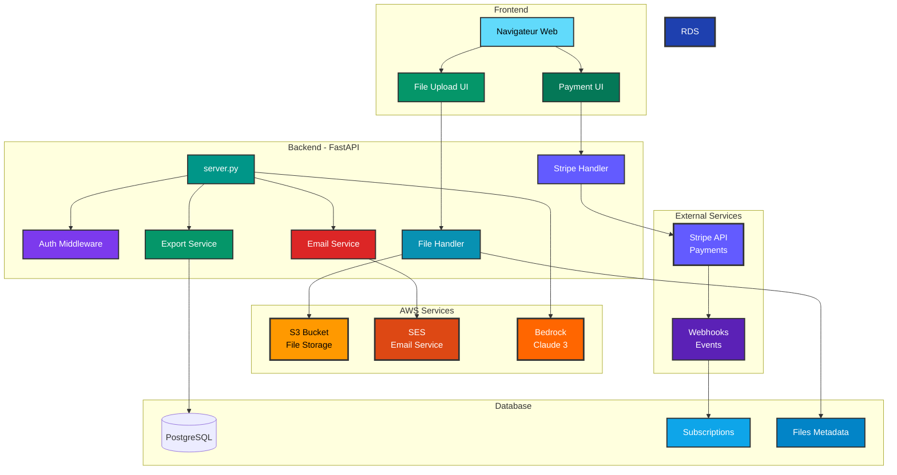

### Nouveaux Composants

| Composant | Technologie | Ajout | Notes |
|-----------|-------------|-------|-------|
| S3 Storage | AWS S3 | ✅ Demo 7 | Stockage fichiers |
| Email | AWS SES | ✅ Demo 8 | Notifications email |
| Payments | Stripe | ✅ Demo 9A | Abonnements SaaS |
| Exports | reportlab/openpyxl | ✅ Demo 9B | PDF, Excel, CSV |

---

## Évolution Niveau 6 : IA Avancée

**Repositories** :
- [awsbedrock-demo-10-rag-pgvector](https://github.com/inskillflow/awsbedrock-demo-10-rag-pgvector)
- [awsbedrock-demo-11-chat-history](https://github.com/inskillflow/awsbedrock-demo-11-chat-history)
- [awsbedrock-demo-11b-agentic-ai](https://github.com/inskillflow/awsbedrock-demo-11b-agentic-ai)

### Ajouts

- RAG avec pgvector
- Embeddings vectoriels
- Historique des conversations
- Système multi-agents

### Diagramme d'Architecture

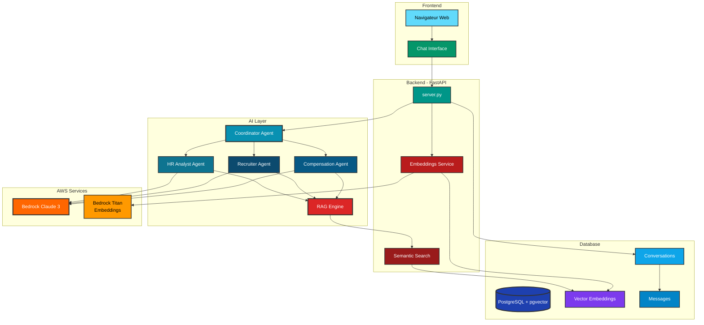

### Nouveaux Composants

| Composant | Technologie | Ajout | Notes |
|-----------|-------------|-------|-------|
| pgvector | PostgreSQL Extension | ✅ Demo 10 | Base vectorielle |
| RAG | LangChain | ✅ Demo 10 | Recherche sémantique |
| Embeddings | AWS Bedrock Titan | ✅ Demo 10 | Vectorisation texte |
| Chat History | SQLAlchemy | ✅ Demo 11 | Conversations |
| Multi-Agents | LangGraph | ✅ Demo 11B | Orchestration agents |

---

## Évolution Niveau 7 : Production

**Repositories** :
- [awsbedrock-demo-12-docker](https://github.com/inskillflow/awsbedrock-demo-12-docker)
- [awsbedrock-demo-13-cicd](https://github.com/inskillflow/awsbedrock-demo-13-cicd)
- [awsbedrock-demo-14-aws-deployment](https://github.com/inskillflow/awsbedrock-demo-14-aws-deployment)
- [awsbedrock-demo-15-monitoring](https://github.com/inskillflow/awsbedrock-demo-15-monitoring)

### Ajouts

- Containerisation Docker
- CI/CD Pipeline
- Déploiement AWS ECS
- Monitoring et logs

### Diagramme d'Architecture

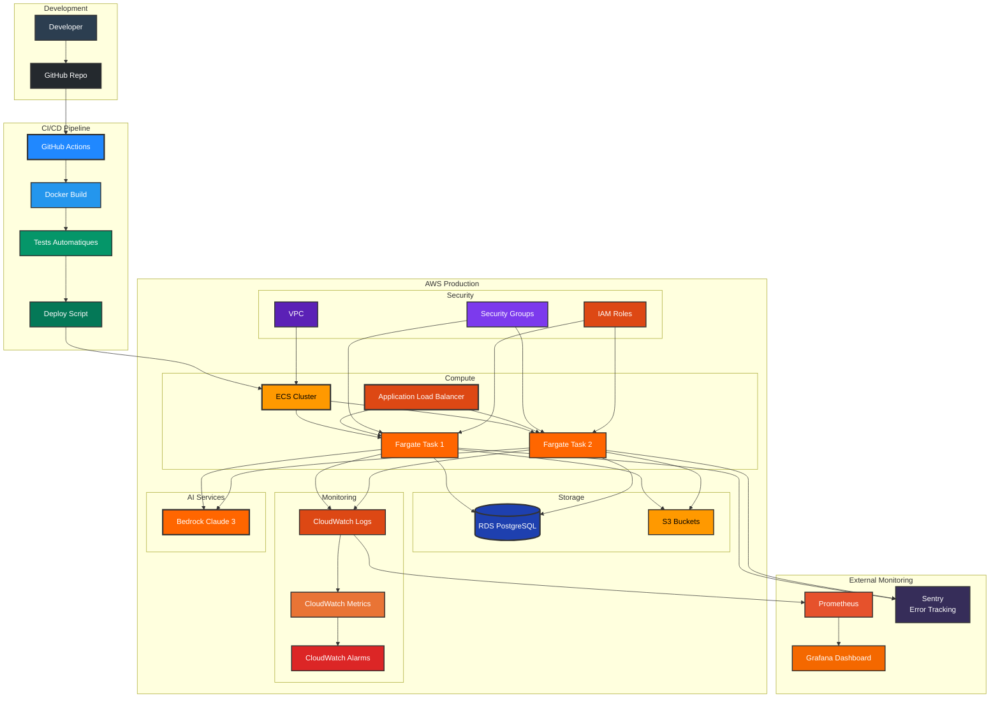

### Nouveaux Composants

| Composant | Technologie | Ajout | Notes |
|-----------|-------------|-------|-------|
| Docker | Containerisation | ✅ Demo 12 | Images Docker |
| CI/CD | GitHub Actions | ✅ Demo 13 | Pipeline automatisé |
| ECS | AWS Fargate | ✅ Demo 14 | Orchestration containers |
| Load Balancer | AWS ALB | ✅ Demo 14 | Distribution charge |
| Monitoring | CloudWatch + Grafana | ✅ Demo 15 | Observabilité |
| Error Tracking | Sentry | ✅ Demo 15 | Suivi des erreurs |

---

## Architecture Finale (Demo 19B)

**Repository** : [awsbedrock-demo-19b-react-app](https://github.com/inskillflow/awsbedrock-demo-19b-react-app)

### Vue d'Ensemble Ultra-Simplifiée

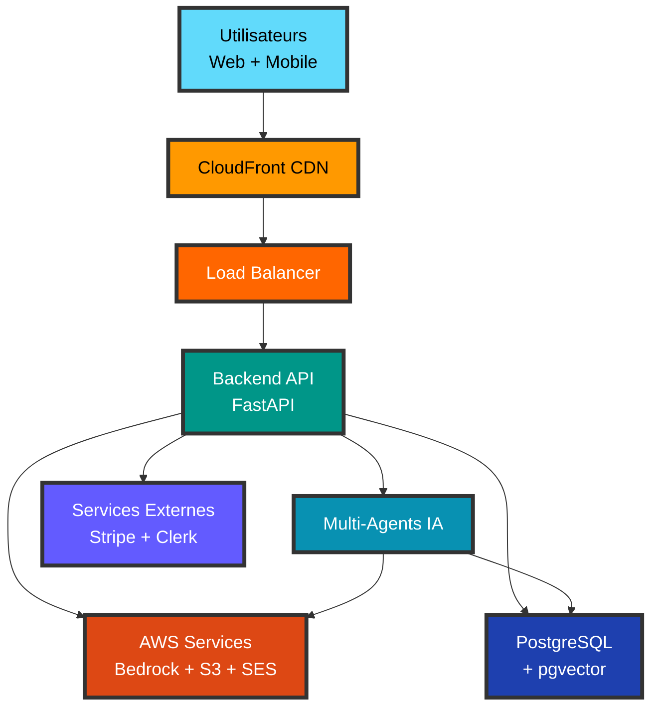

### Diagramme 1 : Flux Frontend → Backend

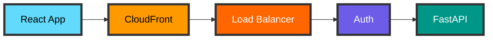

### Diagramme 2 : Backend → Base de Données

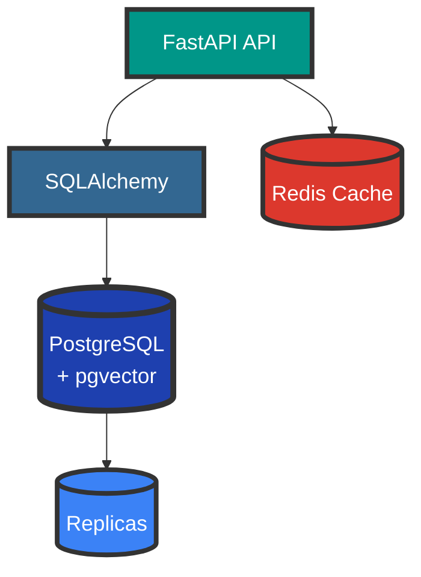

### Diagramme 3 : Système Multi-Agents IA

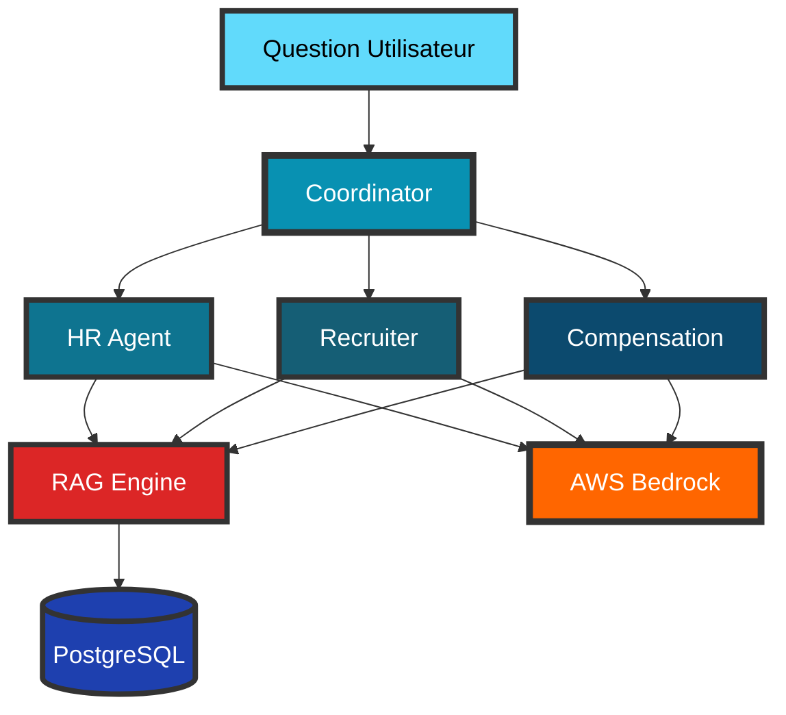

### Diagramme 4 : Services Externes

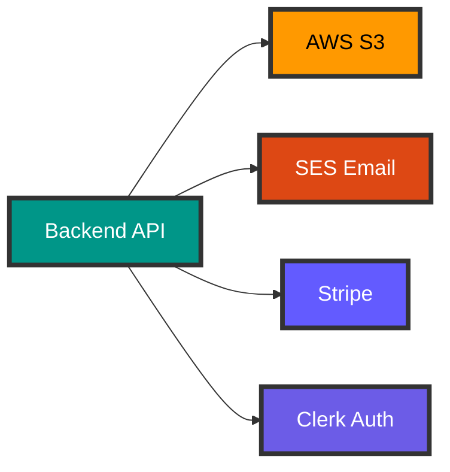

### Diagramme 5 : Déploiement CI/CD

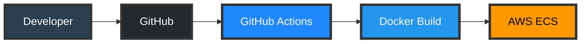

### Diagramme 6 : Monitoring

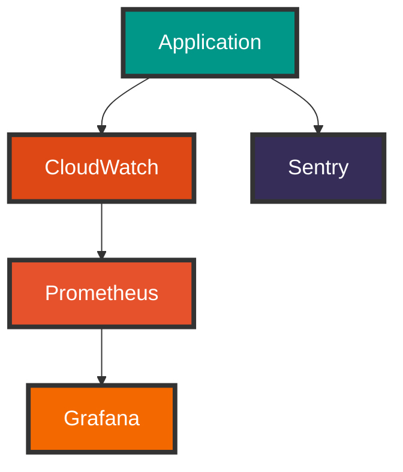

### Architecture Enterprise - Diagrammes Simplifiés

#### Diagramme 7A : Multi-Tenant (Isolation des Données)

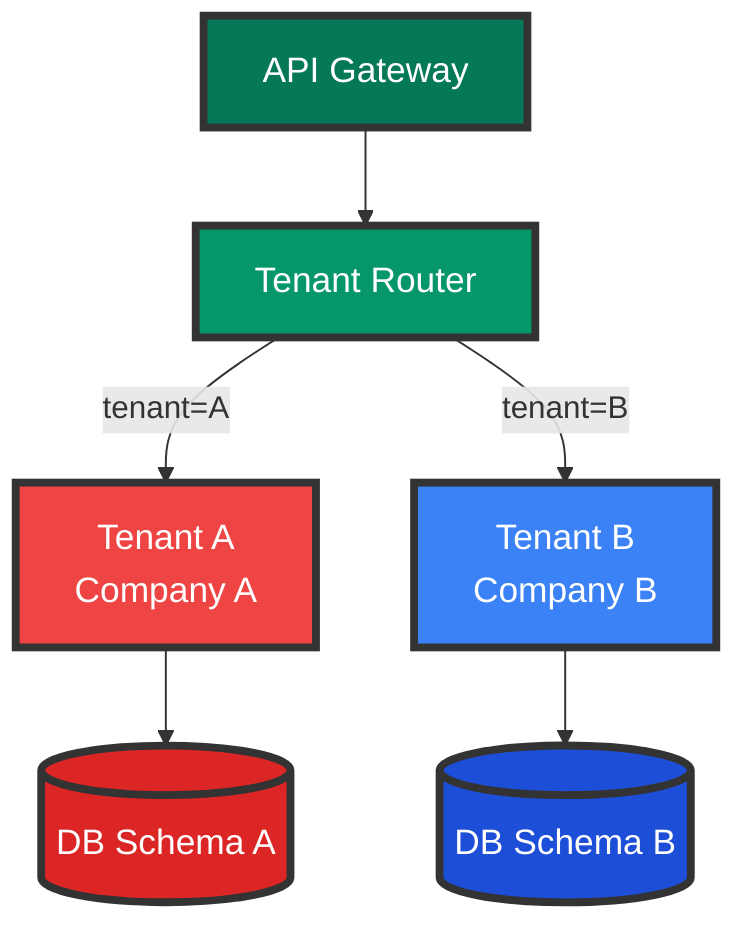

#### Diagramme 7B : Microservices

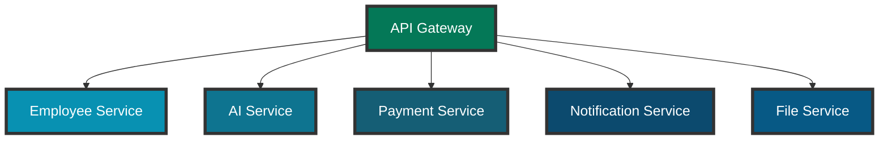

#### Diagramme 7C : Message Queue (Tâches Asynchrones)

```mermaid
flowchart LR
    Services[Services]
    Queue[Message Queue<br/>SQS/RabbitMQ]
    EventBus[Event Bus]
    Workers[Background Workers]
    
    Services --> Queue
    Queue --> EventBus
    EventBus --> Workers
    
    style Services fill:#009688,stroke:#333,stroke-width:4px,color:#fff,font-size:18px
    style Queue fill:#F59E0B,stroke:#333,stroke-width:4px,color:#000,font-size:18px
    style EventBus fill:#D97706,stroke:#333,stroke-width:4px,color:#fff,font-size:18px
    style Workers fill:#B45309,stroke:#333,stroke-width:4px,color:#fff,font-size:18px
```

#### Diagramme 7D : Sécurité

```mermaid
flowchart TD
    Internet[Internet]
    WAF[WAF<br/>Firewall]
    Shield[AWS Shield<br/>DDoS]
    App[Application]
    Secrets[Secrets Manager]
    KMS[KMS Encryption]
    
    Internet --> WAF
    WAF --> Shield
    Shield --> App
    App --> Secrets
    App --> KMS
    
    style Internet fill:#61DAFB,stroke:#333,stroke-width:4px,color:#000,font-size:18px
    style WAF fill:#DC2626,stroke:#333,stroke-width:5px,color:#fff,font-size:18px
    style Shield fill:#991B1B,stroke:#333,stroke-width:4px,color:#fff,font-size:18px
    style App fill:#009688,stroke:#333,stroke-width:4px,color:#fff,font-size:18px
    style Secrets fill:#7C3AED,stroke:#333,stroke-width:4px,color:#fff,font-size:18px
    style KMS fill:#5B21B6,stroke:#333,stroke-width:4px,color:#fff,font-size:18px
```

### Stack Technologique Complet

| Couche | Technologies | Demos |
|--------|--------------|-------|
| **Frontend** | React, TypeScript, Redux, TailwindCSS, Storybook | 19A, 19B |
| **Backend** | FastAPI, Python, Pydantic | 1-19 |
| **Auth** | Clerk, JWT, OAuth2 | 5A, 5B, 6 |
| **Database** | PostgreSQL, pgvector, Neon/Xata | 3, 4, 10 |
| **Caching** | Redis, ElastiCache | 12, 14 |
| **AI** | AWS Bedrock (Claude 3, Titan), LangChain, LangGraph | 2, 10, 11B |
| **Storage** | AWS S3 | 7 |
| **Payments** | Stripe | 9A |
| **Email** | AWS SES, SendGrid | 8 |
| **Notifications** | AWS SNS, Push | 8, 18B |
| **Exports** | reportlab, openpyxl, pandas | 9B |
| **Container** | Docker, Docker Compose | 12 |
| **Orchestration** | AWS ECS, Fargate | 14 |
| **CI/CD** | GitHub Actions, Terraform | 13, 14 |
| **Monitoring** | CloudWatch, Grafana, Prometheus, Sentry | 15 |
| **Load Balancer** | AWS ALB, CloudFront | 14 |
| **Security** | WAF, Shield, KMS, Secrets Manager | 14, 16 |
| **API** | REST, OpenAPI, Rate Limiting | 17 |
| **Documentation** | MkDocs, Sphinx, Storybook | 18A, 19A |

---

## Évolution des Données

### Demo 1 : En Mémoire

```python
# employee_data.py
EMPLOYEES = [
    {"id": 1, "name": "Alice", ...}
]
```

### Demo 3 : PostgreSQL

```sql
CREATE TABLE employees (
    id SERIAL PRIMARY KEY,
    name VARCHAR(255),
    email VARCHAR(255) UNIQUE,
    ...
);
```

### Demo 10 : + pgvector

```sql
CREATE EXTENSION vector;

ALTER TABLE employees 
ADD COLUMN embedding vector(1536);

CREATE INDEX ON employees 
USING ivfflat (embedding vector_cosine_ops);
```

### Demo 16 : Multi-tenant

```sql
CREATE SCHEMA tenant_a;
CREATE SCHEMA tenant_b;

CREATE TABLE tenant_a.employees (...);
CREATE TABLE tenant_b.employees (...);
```

---

## Flux de Données

### Flux Simple (Demo 1-3)

```
User → Frontend → API → Data → Database
```

### Flux avec IA (Demo 10)

```
User → Frontend → API → AI Agent → RAG Engine → pgvector → Database
                                  → AWS Bedrock → Response
```

### Flux Multi-Agent (Demo 11B)

```
User Question
    ↓
Coordinator Agent
    ↓
├─→ HR Analyst Agent ─→ RAG ─→ Bedrock ─→ Response 1
├─→ Recruiter Agent ─→ RAG ─→ Bedrock ─→ Response 2
└─→ Compensation Agent ─→ RAG ─→ Bedrock ─→ Response 3
    ↓
Aggregated Response
    ↓
User
```

### Flux Complet avec Webhooks (Demo 9A)

```
User → Payment UI → Stripe API
                      ↓
                   Webhook
                      ↓
                   Backend API
                      ↓
                 Update Subscription
                      ↓
                   Send Email (SES)
                      ↓
                   Update UI
```

---

## Scalabilité

### Horizontal Scaling

```mermaid
graph LR
    subgraph "Load Balancer"
        ALB[ALB]
    end
    
    subgraph "Auto Scaling Group"
        App1[App Instance 1]
        App2[App Instance 2]
        App3[App Instance 3]
        AppN[App Instance N]
    end
    
    subgraph "Database"
        Primary[(Primary DB)]
        Replica1[(Replica 1)]
        Replica2[(Replica 2)]
    end
    
    subgraph "Cache"
        Redis[(Redis Cluster)]
    end
    
    ALB --> App1
    ALB --> App2
    ALB --> App3
    ALB --> AppN
    
    App1 --> Redis
    App2 --> Redis
    App3 --> Redis
    AppN --> Redis
    
    App1 --> Primary
    App2 --> Primary
    App3 --> Primary
    AppN --> Primary
    
    Primary --> Replica1
    Primary --> Replica2
    
    App1 -.read.-> Replica1
    App2 -.read.-> Replica1
    App3 -.read.-> Replica2
    AppN -.read.-> Replica2
```

---

## Sécurité par Couche

| Couche | Mécanismes de Sécurité | Demos |
|--------|------------------------|-------|
| **Frontend** | HTTPS, CORS, CSP, XSS Protection | 1-19 |
| **API** | JWT, OAuth2, Rate Limiting | 5A, 5B, 17 |
| **Application** | RBAC, Input Validation, SQL Injection Protection | 6 |
| **Network** | VPC, Security Groups, Private Subnets | 14 |
| **Data** | Encryption at Rest (KMS), Encryption in Transit (TLS) | 14, 16 |
| **Secrets** | AWS Secrets Manager, Environment Variables | 14 |
| **DDoS** | AWS Shield, WAF, CloudFront | 14 |
| **Monitoring** | CloudWatch Alarms, Sentry Alerts | 15 |

---

## Coûts Estimés par Architecture

| Architecture | Coût Mensuel | Utilisateurs | Notes |
|--------------|--------------|--------------|-------|
| Demo 1 (Local) | $0 | Development | Gratuit |
| Demo 2 (+ AWS Bedrock) | $30-50 | Testing | IA réelle |
| Demo 3 (+ Neon) | $30-50 | < 100 | Free tier Neon |
| Demo 14 (Production) | $200-500 | 1000 | ECS + RDS + Bedrock |
| Demo 16 (Multi-tenant) | $500-2000 | 10,000 | Scale |
| Demo 19 (Enterprise) | $2000-5000 | 100,000 | Full scale |

---

## Métriques de Performance

### Objectifs par Niveau

| Metric | Demo 1-3 | Demo 14 | Demo 19 |
|--------|----------|---------|---------|
| Response Time | < 1s | < 500ms | < 200ms |
| Availability | 95% | 99.5% | 99.9% |
| Concurrent Users | 10 | 1,000 | 100,000 |
| Requests/sec | 10 | 1,000 | 10,000 |
| Database Size | 1 MB | 10 GB | 1 TB |

---

## Résumé de l'Évolution

```mermaid
timeline
    title Évolution de l'Architecture
    section Fondations
        Demo 1 : API REST + IA Local + Mémoire
    section Cloud
        Demo 2 : AWS Bedrock Réel
    section Persistance
        Demo 3-4 : PostgreSQL / Xata
    section Sécurité
        Demo 5-6 : Auth + RBAC
    section Features
        Demo 7-9 : S3 + Emails + Stripe + Exports
    section IA Avancée
        Demo 10-11 : RAG + pgvector + Multi-Agents
    section Production
        Demo 12-15 : Docker + CI/CD + AWS + Monitoring
    section Enterprise
        Demo 16-19 : Multi-tenant + API Public + React
```

---

**Auteur** : Haythem REHOUMA - Gneurone Inc.  
**Contact** : contact@gneuroneai.com  
**GitHub** : https://github.com/inskillflow

