# Architecture du Système - Évolution Progressive

Ce document présente l'architecture du système et son évolution à travers les différents demos.

## Table des matières

- [Architecture Actuelle (Demo 1)](#architecture-actuelle-demo-1)
- [Évolution Niveau 2 : AWS Bedrock](#évolution-niveau-2--aws-bedrock)
- [Évolution Niveau 3 : Persistance](#évolution-niveau-3--persistance)
- [Évolution Niveau 4 : Authentification](#évolution-niveau-4--authentification)
- [Évolution Niveau 5 : Fonctionnalités Avancées](#évolution-niveau-5--fonctionnalités-avancées)
- [Évolution Niveau 6 : IA Avancée](#évolution-niveau-6--ia-avancée)
- [Évolution Niveau 7 : Production](#évolution-niveau-7--production)
- [Architecture Finale (Demo 19B)](#architecture-finale-demo-19b)

---

## Architecture Actuelle (Demo 1)

**Repository** : [awsbedrock-demo-1-inmemory](https://github.com/inskillflow/awsbedrock-demo-1-inmemory)

### Description

Système simple avec API REST, interface web, et IA en mode local. Toutes les données sont en mémoire.

### Diagramme d'Architecture - Vue Simplifiée

```mermaid
flowchart LR
    User[👤 Utilisateur]
    Frontend[🌐 Frontend<br/>HTML + JS]
    Backend[⚙️ Backend<br/>FastAPI]
    Data[💾 Données<br/>En Mémoire]
    AI[🤖 IA<br/>Mode Local]
    
    User --> Frontend
    Frontend -->|HTTP/REST| Backend
    Backend --> Data
    Backend --> AI
    AI --> Data
    
    style User fill:#61DAFB,stroke:#333,stroke-width:3px,color:#000,font-size:16px
    style Frontend fill:#E34F26,stroke:#333,stroke-width:3px,color:#fff,font-size:16px
    style Backend fill:#009688,stroke:#333,stroke-width:3px,color:#fff,font-size:16px
    style Data fill:#FF6B6B,stroke:#333,stroke-width:3px,color:#fff,font-size:16px
    style AI fill:#FFA500,stroke:#333,stroke-width:3px,color:#000,font-size:16px
```

### Architecture Détaillée

```mermaid
graph TB
    Browser[Navigateur Web]
    HTML[index.html]
    JS[app.js]
    
    API[server.py<br/>FastAPI]
    Data[employee_data.py<br/>Liste Python]
    AI[ai_agent.py<br/>Règles if/else]
    
    Browser --> HTML
    HTML --> JS
    JS -->|Requêtes HTTP| API
    
    API --> Data
    API --> AI
    AI -->|Lit les données| Data
    
    style Browser fill:#61DAFB,stroke:#333,stroke-width:4px,color:#000,font-size:18px
    style HTML fill:#E34F26,stroke:#333,stroke-width:4px,color:#fff,font-size:18px
    style JS fill:#F7DF1E,stroke:#333,stroke-width:4px,color:#000,font-size:18px
    style API fill:#009688,stroke:#333,stroke-width:4px,color:#fff,font-size:18px
    style Data fill:#FF6B6B,stroke:#333,stroke-width:4px,color:#fff,font-size:18px
    style AI fill:#FFA500,stroke:#333,stroke-width:4px,color:#000,font-size:18px
```

### Composants

| Composant | Technologie | Statut | Notes |
|-----------|-------------|--------|-------|
| Frontend | HTML5 + JavaScript | ✅ Actuel | Interface web responsive |
| API REST | FastAPI | ✅ Actuel | Endpoints CRUD complets |
| Données | Python Lists | ⚠️ Temporaire | En mémoire, non persistant |
| IA | Mode Local | ⚠️ Basique | Règles simples, pas de vraie IA |

### Limitations

- ❌ Pas de persistance (données perdues au redémarrage)
- ❌ IA basique (mode local avec règles)
- ❌ Pas d'authentification
- ❌ Pas de gestion de fichiers

---

## Évolution Niveau 2 : AWS Bedrock

**Repository** : [awsbedrock-demo-2-aws-bedrock-real](https://github.com/inskillflow/awsbedrock-demo-2-aws-bedrock-real)

### Ajouts

- Configuration AWS complète
- IA réelle avec Claude 3 Sonnet
- Credentials AWS sécurisés

### Diagramme d'Architecture - Vue Simplifiée

```mermaid
flowchart LR
    User[👤 Utilisateur]
    Frontend[🌐 Frontend<br/>HTML + JS]
    Backend[⚙️ Backend<br/>FastAPI]
    Data[💾 Données<br/>En Mémoire]
    AWS[☁️ AWS Bedrock<br/>Claude 3]
    
    User --> Frontend
    Frontend -->|HTTP/REST| Backend
    Backend --> Data
    Backend -->|Appel IA| AWS
    AWS -->|Réponse| Backend
    
    style User fill:#61DAFB,stroke:#333,stroke-width:3px,color:#000,font-size:16px
    style Frontend fill:#E34F26,stroke:#333,stroke-width:3px,color:#fff,font-size:16px
    style Backend fill:#009688,stroke:#333,stroke-width:3px,color:#fff,font-size:16px
    style Data fill:#FF6B6B,stroke:#333,stroke-width:3px,color:#fff,font-size:16px
    style AWS fill:#FF6600,stroke:#333,stroke-width:4px,color:#fff,font-size:16px
```

### Architecture Détaillée

```mermaid
graph TB
    Browser[Navigateur]
    JS[app.js]
    
    API[server.py<br/>FastAPI]
    Data[Données<br/>En Mémoire]
    AI[ai_agent.py]
    
    Bedrock[AWS Bedrock<br/>Claude 3]
    IAM[AWS IAM]
    
    Browser --> JS
    JS -->|HTTP| API
    
    API --> Data
    API --> AI
    AI -->|boto3| Bedrock
    AI --> IAM
    
    style Browser fill:#61DAFB,stroke:#333,stroke-width:4px,color:#000,font-size:18px
    style JS fill:#F7DF1E,stroke:#333,stroke-width:4px,color:#000,font-size:18px
    style API fill:#009688,stroke:#333,stroke-width:4px,color:#fff,font-size:18px
    style Data fill:#FF6B6B,stroke:#333,stroke-width:4px,color:#fff,font-size:18px
    style AI fill:#FFA500,stroke:#333,stroke-width:4px,color:#000,font-size:18px
    style Bedrock fill:#FF6600,stroke:#333,stroke-width:5px,color:#fff,font-size:18px
    style IAM fill:#DD4814,stroke:#333,stroke-width:4px,color:#fff,font-size:18px
```

### Nouveaux Composants

| Composant | Technologie | Ajout | Notes |
|-----------|-------------|-------|-------|
| AWS Bedrock | Claude 3 Sonnet | ✅ Demo 2 | IA réelle et puissante |
| AWS IAM | Credentials | ✅ Demo 2 | Sécurité et permissions |
| Boto3 | SDK Python | ✅ Demo 2 | Client AWS |

---

## Évolution Niveau 3 : Persistance

**Repositories** : 
- [awsbedrock-demo-3-postgresql](https://github.com/inskillflow/awsbedrock-demo-3-postgresql)
- [awsbedrock-demo-4-xata](https://github.com/inskillflow/awsbedrock-demo-4-xata)

### Ajouts

- Base de données PostgreSQL (Neon)
- ORM SQLAlchemy
- Migrations Alembic
- Alternative : Xata

### Diagramme d'Architecture - Vue Simplifiée

```mermaid
flowchart LR
    User[👤 Utilisateur]
    Frontend[🌐 Frontend]
    Backend[⚙️ Backend]
    DB[💾 PostgreSQL<br/>Neon]
    AWS[☁️ AWS Bedrock]
    
    User --> Frontend
    Frontend -->|HTTP/REST| Backend
    Backend --> DB
    Backend --> AWS
    
    style User fill:#61DAFB,stroke:#333,stroke-width:3px,color:#000,font-size:16px
    style Frontend fill:#E34F26,stroke:#333,stroke-width:3px,color:#fff,font-size:16px
    style Backend fill:#009688,stroke:#333,stroke-width:3px,color:#fff,font-size:16px
    style DB fill:#1E40AF,stroke:#333,stroke-width:4px,color:#fff,font-size:16px
    style AWS fill:#FF6600,stroke:#333,stroke-width:4px,color:#fff,font-size:16px
```

### Architecture Détaillée

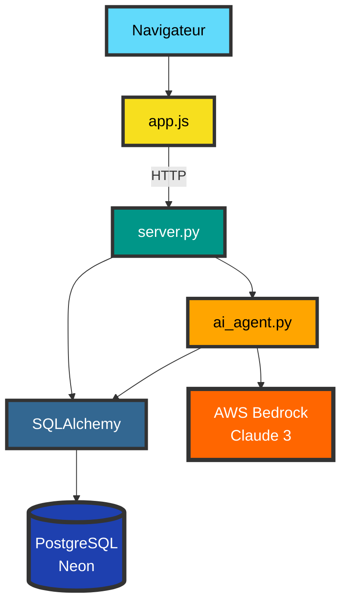

### Nouveaux Composants

| Composant | Technologie | Ajout | Notes |
|-----------|-------------|-------|-------|
| PostgreSQL | Neon Serverless | ✅ Demo 3 | Base de données persistante |
| ORM | SQLAlchemy | ✅ Demo 3 | Mapping objet-relationnel |
| Migrations | Alembic | ✅ Demo 3 | Gestion du schéma |
| Alternative DB | Xata | ✅ Demo 4 | Base moderne avec recherche |

---

## Évolution Niveau 4 : Authentification

**Repositories** :
- [awsbedrock-demo-5a-auth-clerk](https://github.com/inskillflow/awsbedrock-demo-5a-auth-clerk)
- [awsbedrock-demo-5b-auth-jwt-custom](https://github.com/inskillflow/awsbedrock-demo-5b-auth-jwt-custom)
- [awsbedrock-demo-6-rbac](https://github.com/inskillflow/awsbedrock-demo-6-rbac)

### Ajouts

- Authentification (Clerk ou JWT)
- Gestion des sessions
- Rôles et permissions (RBAC)
- Protection des endpoints

### Diagramme d'Architecture - Vue Simplifiée

```mermaid
flowchart LR
    User[👤 Utilisateur]
    Login[🔐 Login]
    Auth[🛡️ Auth<br/>Clerk/JWT]
    Backend[⚙️ Backend<br/>+ RBAC]
    DB[💾 PostgreSQL<br/>+ Users]
    
    User --> Login
    Login --> Auth
    Auth -->|Token| Backend
    Backend --> DB
    
    style User fill:#61DAFB,stroke:#333,stroke-width:3px,color:#000,font-size:16px
    style Login fill:#34D399,stroke:#333,stroke-width:3px,color:#fff,font-size:16px
    style Auth fill:#6C5CE7,stroke:#333,stroke-width:4px,color:#fff,font-size:16px
    style Backend fill:#009688,stroke:#333,stroke-width:3px,color:#fff,font-size:16px
    style DB fill:#1E40AF,stroke:#333,stroke-width:4px,color:#fff,font-size:16px
```

### Architecture Détaillée

```mermaid
graph TB
    Browser[Navigateur]
    Login[Interface Login]
    
    Clerk[Clerk Service]
    Auth[Middleware Auth]
    
    API[FastAPI]
    RBAC[RBAC Engine]
    
    DB[(PostgreSQL)]
    Users[Table Users]
    Roles[Table Roles]
    
    Browser --> Login
    Login --> Clerk
    Login -->|Token JWT| Auth
    Auth --> API
    API --> RBAC
    RBAC -->|Vérifie| Roles
    
    API --> DB
    DB --> Users
    DB --> Roles
    
    style Browser fill:#61DAFB,stroke:#333,stroke-width:4px,color:#000,font-size:18px
    style Login fill:#34D399,stroke:#333,stroke-width:4px,color:#fff,font-size:18px
    style Clerk fill:#6C5CE7,stroke:#333,stroke-width:5px,color:#fff,font-size:18px
    style Auth fill:#7C3AED,stroke:#333,stroke-width:4px,color:#fff,font-size:18px
    style API fill:#009688,stroke:#333,stroke-width:4px,color:#fff,font-size:18px
    style RBAC fill:#DC2626,stroke:#333,stroke-width:4px,color:#fff,font-size:18px
    style DB fill:#1E40AF,stroke:#333,stroke-width:5px,color:#fff,font-size:18px
    style Users fill:#0EA5E9,stroke:#333,stroke-width:4px,color:#fff,font-size:18px
    style Roles fill:#0284C7,stroke:#333,stroke-width:4px,color:#fff,font-size:18px
```

### Nouveaux Composants

| Composant | Technologie | Ajout | Notes |
|-----------|-------------|-------|-------|
| Auth Service | Clerk | ✅ Demo 5A | Auth rapide (15 min) |
| JWT Custom | python-jose | ✅ Demo 5B | JWT from scratch |
| RBAC | Custom | ✅ Demo 6 | Gestion des rôles |
| Middleware | FastAPI | ✅ Demo 5 | Protection endpoints |

---

## Évolution Niveau 5 : Fonctionnalités Avancées

**Repositories** :
- [awsbedrock-demo-7-files-s3](https://github.com/inskillflow/awsbedrock-demo-7-files-s3)
- [awsbedrock-demo-8-notifications](https://github.com/inskillflow/awsbedrock-demo-8-notifications)
- [awsbedrock-demo-9a-stripe](https://github.com/inskillflow/awsbedrock-demo-9a-stripe)
- [awsbedrock-demo-9b-exports](https://github.com/inskillflow/awsbedrock-demo-9b-exports)

### Ajouts

- Upload de fichiers vers S3
- Notifications et emails
- Abonnements Stripe
- Exports PDF/Excel

### Diagramme d'Architecture

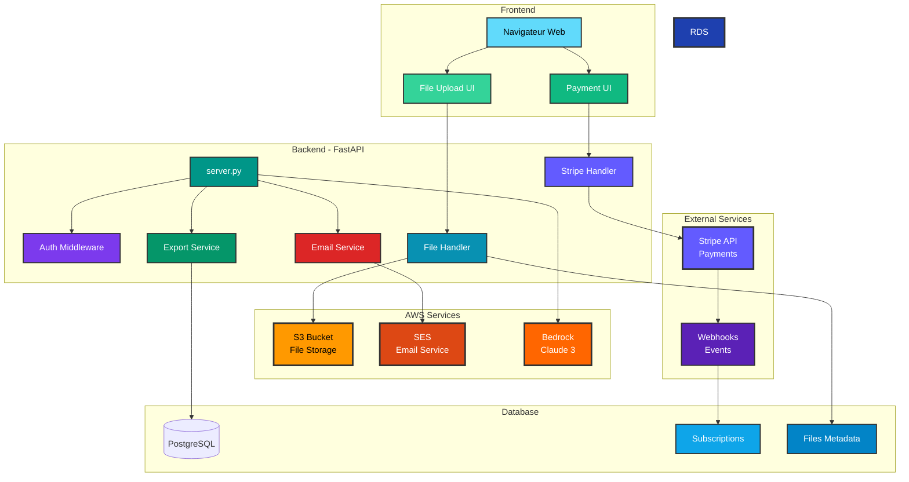

### Nouveaux Composants

| Composant | Technologie | Ajout | Notes |
|-----------|-------------|-------|-------|
| S3 Storage | AWS S3 | ✅ Demo 7 | Stockage fichiers |
| Email | AWS SES | ✅ Demo 8 | Notifications email |
| Payments | Stripe | ✅ Demo 9A | Abonnements SaaS |
| Exports | reportlab/openpyxl | ✅ Demo 9B | PDF, Excel, CSV |

---

## Évolution Niveau 6 : IA Avancée

**Repositories** :
- [awsbedrock-demo-10-rag-pgvector](https://github.com/inskillflow/awsbedrock-demo-10-rag-pgvector)
- [awsbedrock-demo-11-chat-history](https://github.com/inskillflow/awsbedrock-demo-11-chat-history)
- [awsbedrock-demo-11b-agentic-ai](https://github.com/inskillflow/awsbedrock-demo-11b-agentic-ai)

### Ajouts

- RAG avec pgvector
- Embeddings vectoriels
- Historique des conversations
- Système multi-agents

### Diagramme d'Architecture


### Nouveaux Composants

| Composant | Technologie | Ajout | Notes |
|-----------|-------------|-------|-------|
| pgvector | PostgreSQL Extension | ✅ Demo 10 | Base vectorielle |
| RAG | LangChain | ✅ Demo 10 | Recherche sémantique |
| Embeddings | AWS Bedrock Titan | ✅ Demo 10 | Vectorisation texte |
| Chat History | SQLAlchemy | ✅ Demo 11 | Conversations |
| Multi-Agents | LangGraph | ✅ Demo 11B | Orchestration agents |

---

## Évolution Niveau 7 : Production

**Repositories** :
- [awsbedrock-demo-12-docker](https://github.com/inskillflow/awsbedrock-demo-12-docker)
- [awsbedrock-demo-13-cicd](https://github.com/inskillflow/awsbedrock-demo-13-cicd)
- [awsbedrock-demo-14-aws-deployment](https://github.com/inskillflow/awsbedrock-demo-14-aws-deployment)
- [awsbedrock-demo-15-monitoring](https://github.com/inskillflow/awsbedrock-demo-15-monitoring)

### Ajouts

- Containerisation Docker
- CI/CD Pipeline
- Déploiement AWS ECS
- Monitoring et logs

### Diagramme d'Architecture

```mermaid
graph TB
    subgraph "Development"
        Dev[Developer]
        Git[GitHub Repo]
    end
    
    subgraph "CI/CD Pipeline"
        Actions[GitHub Actions]
        Build[Docker Build]
        Tests[Tests Automatiques]
        Deploy[Deploy Script]
    end
    
    subgraph "AWS Production"
        subgraph "Compute"
            ALB[Application Load Balancer]
            ECS[ECS Cluster]
            Fargate1[Fargate Task 1]
            Fargate2[Fargate Task 2]
        end
        
        subgraph "Storage"
            RDS[(RDS PostgreSQL)]
            S3[S3 Buckets]
        end
        
        subgraph "Monitoring"
            CloudWatch[CloudWatch Logs]
            Metrics[CloudWatch Metrics]
            Alarms[CloudWatch Alarms]
        end
        
        subgraph "Security"
            VPC[VPC]
            SecGroups[Security Groups]
            IAM[IAM Roles]
        end
        
        subgraph "AI Services"
            Bedrock[Bedrock Claude 3]
        end
    end
    
    subgraph "External Monitoring"
        Grafana[Grafana Dashboard]
        Prometheus[Prometheus]
        Sentry[Sentry<br/>Error Tracking]
    end
    
    Dev --> Git
    Git --> Actions
    Actions --> Build
    Build --> Tests
    Tests --> Deploy
    Deploy --> ECS
    
    ECS --> Fargate1
    ECS --> Fargate2
    
    ALB --> Fargate1
    ALB --> Fargate2
    
    Fargate1 --> RDS
    Fargate2 --> RDS
    Fargate1 --> S3
    Fargate2 --> S3
    Fargate1 --> Bedrock
    Fargate2 --> Bedrock
    
    Fargate1 --> CloudWatch
    Fargate2 --> CloudWatch
    CloudWatch --> Metrics
    Metrics --> Alarms
    
    CloudWatch --> Prometheus
    Prometheus --> Grafana
    
    Fargate1 --> Sentry
    Fargate2 --> Sentry
    
    VPC --> ECS
    SecGroups --> Fargate1
    SecGroups --> Fargate2
    IAM --> Fargate1
    IAM --> Fargate2
    
    style ECS fill:#ff9900
    style Fargate1 fill:#ff9900
    style Fargate2 fill:#ff9900
    style RDS fill:#ff9900
    style CloudWatch fill:#ff9900
    style ALB fill:#ff9900
    style Grafana fill:#F46800
    style Prometheus fill:#E6522C
    style Sentry fill:#362D59
    
    classDef new fill:#90EE90
    class Build,Tests,Deploy,ECS,Fargate1,Fargate2,CloudWatch,Metrics,Alarms,Grafana,Prometheus,Sentry,ALB,VPC,SecGroups new
```

### Nouveaux Composants

| Composant | Technologie | Ajout | Notes |
|-----------|-------------|-------|-------|
| Docker | Containerisation | ✅ Demo 12 | Images Docker |
| CI/CD | GitHub Actions | ✅ Demo 13 | Pipeline automatisé |
| ECS | AWS Fargate | ✅ Demo 14 | Orchestration containers |
| Load Balancer | AWS ALB | ✅ Demo 14 | Distribution charge |
| Monitoring | CloudWatch + Grafana | ✅ Demo 15 | Observabilité |
| Error Tracking | Sentry | ✅ Demo 15 | Suivi des erreurs |

---

## Architecture Finale (Demo 19B)

**Repository** : [awsbedrock-demo-19b-react-app](https://github.com/inskillflow/awsbedrock-demo-19b-react-app)

### Vue d'Ensemble Complète

```mermaid
graph TB
    subgraph "Clients"
        WebApp[React App<br/>TypeScript]
        Mobile[Mobile App]
        API_Client[API Clients]
    end
    
    subgraph "CDN & Load Balancing"
        CloudFront[CloudFront CDN]
        ALB[Application Load Balancer]
        RateLimit[Rate Limiter]
    end
    
    subgraph "API Layer"
        subgraph "Services"
            Auth[Auth Service<br/>Clerk/JWT]
            API[Main API<br/>FastAPI]
            PublicAPI[Public API<br/>Versioned]
        end
        
        subgraph "Business Logic"
            RBAC[RBAC Engine]
            Quotas[Quotas Manager]
            Cache[Redis Cache]
        end
    end
    
    subgraph "AI Layer - Multi-Agent System"
        Coordinator[Coordinator<br/>Agent]
        
        subgraph "Specialized Agents"
            HRAgent[HR Analyst<br/>Agent]
            RecruiterAgent[Recruiter<br/>Agent]
            CompAgent[Compensation<br/>Agent]
            CustomAgent[Custom<br/>Agents]
        end
        
        RAG[RAG Engine<br/>Semantic Search]
        Memory[Conversation<br/>Memory]
    end
    
    subgraph "Data Layer"
        subgraph "Primary Database"
            RDS[(RDS PostgreSQL<br/>+ pgvector)]
            Replicas[(Read Replicas)]
        end
        
        subgraph "Storage"
            S3_Files[S3 Files]
            S3_Backups[S3 Backups]
        end
        
        subgraph "Caching"
            Redis[(Redis)]
            ElastiCache[(ElastiCache)]
        end
    end
    
    subgraph "AWS Services"
        Bedrock[Bedrock<br/>Claude 3 Sonnet]
        BedrockEmbed[Bedrock Titan<br/>Embeddings]
        SES[SES<br/>Emails]
        SNS[SNS<br/>Notifications]
    end
    
    subgraph "External Services"
        Stripe[Stripe<br/>Payments]
        Clerk_Ext[Clerk<br/>Auth]
        Webhooks[Webhooks<br/>Handlers]
    end
    
    subgraph "Monitoring & Observability"
        CloudWatch[CloudWatch]
        Grafana[Grafana]
        Prometheus[Prometheus]
        Sentry[Sentry]
        Logs[ELK Stack]
    end
    
    subgraph "CI/CD"
        GitHub[GitHub]
        Actions[GitHub Actions]
        DockerHub[Docker Registry]
        Terraform[Terraform<br/>IaC]
    end
    
    WebApp --> CloudFront
    Mobile --> CloudFront
    API_Client --> ALB
    
    CloudFront --> ALB
    ALB --> RateLimit
    RateLimit --> Auth
    
    Auth --> Clerk_Ext
    Auth --> API
    Auth --> PublicAPI
    
    API --> RBAC
    API --> Quotas
    API --> Cache
    
    API --> Coordinator
    Coordinator --> HRAgent
    Coordinator --> RecruiterAgent
    Coordinator --> CompAgent
    Coordinator --> CustomAgent
    
    HRAgent --> RAG
    RecruiterAgent --> RAG
    CompAgent --> RAG
    
    RAG --> RDS
    API --> RDS
    RDS --> Replicas
    
    API --> S3_Files
    RDS --> S3_Backups
    
    Cache --> Redis
    API --> ElastiCache
    
    HRAgent --> Bedrock
    RecruiterAgent --> Bedrock
    CompAgent --> Bedrock
    RAG --> BedrockEmbed
    
    API --> SES
    API --> SNS
    
    API --> Stripe
    Stripe --> Webhooks
    Webhooks --> API
    
    API --> CloudWatch
    API --> Sentry
    CloudWatch --> Grafana
    CloudWatch --> Prometheus
    API --> Logs
    
    GitHub --> Actions
    Actions --> DockerHub
    Actions --> Terraform
    Terraform --> ALB
    
    Memory --> RDS
    Coordinator --> Memory
    
    style WebApp fill:#61DAFB,stroke:#333,stroke-width:2px,color:#000
    style Mobile fill:#34D399,stroke:#333,stroke-width:2px,color:#fff
    style API_Client fill:#10B981,stroke:#333,stroke-width:2px,color:#fff
    style CloudFront fill:#FF9900,stroke:#333,stroke-width:3px,color:#000
    style ALB fill:#FF6600,stroke:#333,stroke-width:3px,color:#fff
    style RateLimit fill:#F59E0B,stroke:#333,stroke-width:2px,color:#000
    style Auth fill:#7C3AED,stroke:#333,stroke-width:2px,color:#fff
    style API fill:#009688,stroke:#333,stroke-width:2px,color:#fff
    style PublicAPI fill:#059669,stroke:#333,stroke-width:2px,color:#fff
    style RBAC fill:#DC2626,stroke:#333,stroke-width:2px,color:#fff
    style Quotas fill:#B91C1C,stroke:#333,stroke-width:2px,color:#fff
    style Cache fill:#991B1B,stroke:#333,stroke-width:2px,color:#fff
    style Coordinator fill:#0891B2,stroke:#333,stroke-width:3px,color:#fff
    style HRAgent fill:#0E7490,stroke:#333,stroke-width:2px,color:#fff
    style RecruiterAgent fill:#155E75,stroke:#333,stroke-width:2px,color:#fff
    style CompAgent fill:#0C4A6E,stroke:#333,stroke-width:2px,color:#fff
    style CustomAgent fill:#075985,stroke:#333,stroke-width:2px,color:#fff
    style RAG fill:#DC2626,stroke:#333,stroke-width:3px,color:#fff
    style Memory fill:#7C3AED,stroke:#333,stroke-width:2px,color:#fff
    style RDS fill:#1E40AF,stroke:#333,stroke-width:3px,color:#fff
    style Replicas fill:#3B82F6,stroke:#333,stroke-width:2px,color:#fff
    style S3_Files fill:#FF9900,stroke:#333,stroke-width:2px,color:#000
    style S3_Backups fill:#F59E0B,stroke:#333,stroke-width:2px,color:#000
    style Redis fill:#DC382D,stroke:#333,stroke-width:3px,color:#fff
    style ElastiCache fill:#B91C1C,stroke:#333,stroke-width:2px,color:#fff
    style Bedrock fill:#FF6600,stroke:#333,stroke-width:3px,color:#fff
    style BedrockEmbed fill:#FF9900,stroke:#333,stroke-width:2px,color:#000
    style SES fill:#DD4814,stroke:#333,stroke-width:2px,color:#fff
    style SNS fill:#E97435,stroke:#333,stroke-width:2px,color:#fff
    style Stripe fill:#635BFF,stroke:#333,stroke-width:3px,color:#fff
    style Clerk_Ext fill:#6C5CE7,stroke:#333,stroke-width:2px,color:#fff
    style Webhooks fill:#5B21B6,stroke:#333,stroke-width:2px,color:#fff
    style CloudWatch fill:#DD4814,stroke:#333,stroke-width:2px,color:#fff
    style Grafana fill:#F46800,stroke:#333,stroke-width:2px,color:#fff
    style Prometheus fill:#E6522C,stroke:#333,stroke-width:2px,color:#fff
    style Sentry fill:#362D59,stroke:#333,stroke-width:2px,color:#fff
    style Logs fill:#2C3E50,stroke:#333,stroke-width:2px,color:#fff
    style GitHub fill:#24292E,stroke:#333,stroke-width:2px,color:#fff
    style Actions fill:#2088FF,stroke:#333,stroke-width:2px,color:#fff
    style DockerHub fill:#2496ED,stroke:#333,stroke-width:2px,color:#fff
    style Terraform fill:#7B42BC,stroke:#333,stroke-width:2px,color:#fff
```

### Architecture Enterprise Complète

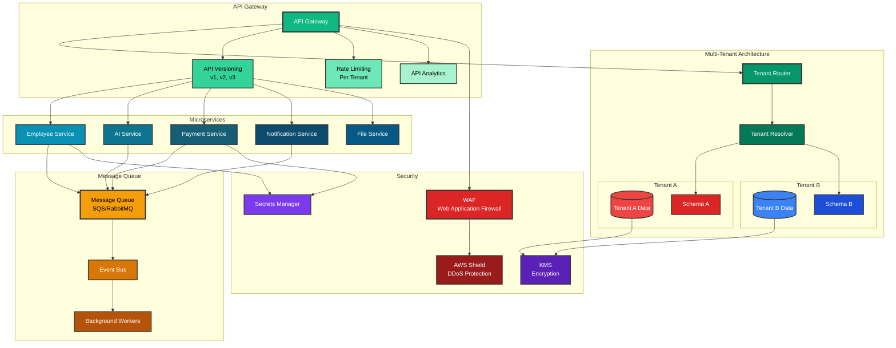

### Stack Technologique Complet

| Couche | Technologies | Demos |
|--------|--------------|-------|
| **Frontend** | React, TypeScript, Redux, TailwindCSS, Storybook | 19A, 19B |
| **Backend** | FastAPI, Python, Pydantic | 1-19 |
| **Auth** | Clerk, JWT, OAuth2 | 5A, 5B, 6 |
| **Database** | PostgreSQL, pgvector, Neon/Xata | 3, 4, 10 |
| **Caching** | Redis, ElastiCache | 12, 14 |
| **AI** | AWS Bedrock (Claude 3, Titan), LangChain, LangGraph | 2, 10, 11B |
| **Storage** | AWS S3 | 7 |
| **Payments** | Stripe | 9A |
| **Email** | AWS SES, SendGrid | 8 |
| **Notifications** | AWS SNS, Push | 8, 18B |
| **Exports** | reportlab, openpyxl, pandas | 9B |
| **Container** | Docker, Docker Compose | 12 |
| **Orchestration** | AWS ECS, Fargate | 14 |
| **CI/CD** | GitHub Actions, Terraform | 13, 14 |
| **Monitoring** | CloudWatch, Grafana, Prometheus, Sentry | 15 |
| **Load Balancer** | AWS ALB, CloudFront | 14 |
| **Security** | WAF, Shield, KMS, Secrets Manager | 14, 16 |
| **API** | REST, OpenAPI, Rate Limiting | 17 |
| **Documentation** | MkDocs, Sphinx, Storybook | 18A, 19A |

---

## Évolution des Données

### Demo 1 : En Mémoire

```python
# employee_data.py
EMPLOYEES = [
    {"id": 1, "name": "Alice", ...}
]
```

### Demo 3 : PostgreSQL

```sql
CREATE TABLE employees (
    id SERIAL PRIMARY KEY,
    name VARCHAR(255),
    email VARCHAR(255) UNIQUE,
    ...
);
```

### Demo 10 : + pgvector

```sql
CREATE EXTENSION vector;

ALTER TABLE employees 
ADD COLUMN embedding vector(1536);

CREATE INDEX ON employees 
USING ivfflat (embedding vector_cosine_ops);
```

### Demo 16 : Multi-tenant

```sql
CREATE SCHEMA tenant_a;
CREATE SCHEMA tenant_b;

CREATE TABLE tenant_a.employees (...);
CREATE TABLE tenant_b.employees (...);
```

---

## Flux de Données

### Flux Simple (Demo 1-3)

```
User → Frontend → API → Data → Database
```

### Flux avec IA (Demo 10)

```
User → Frontend → API → AI Agent → RAG Engine → pgvector → Database
                                  → AWS Bedrock → Response
```

### Flux Multi-Agent (Demo 11B)

```
User Question
    ↓
Coordinator Agent
    ↓
├─→ HR Analyst Agent ─→ RAG ─→ Bedrock ─→ Response 1
├─→ Recruiter Agent ─→ RAG ─→ Bedrock ─→ Response 2
└─→ Compensation Agent ─→ RAG ─→ Bedrock ─→ Response 3
    ↓
Aggregated Response
    ↓
User
```

### Flux Complet avec Webhooks (Demo 9A)

```
User → Payment UI → Stripe API
                      ↓
                   Webhook
                      ↓
                   Backend API
                      ↓
                 Update Subscription
                      ↓
                   Send Email (SES)
                      ↓
                   Update UI
```

---

## Scalabilité

### Horizontal Scaling

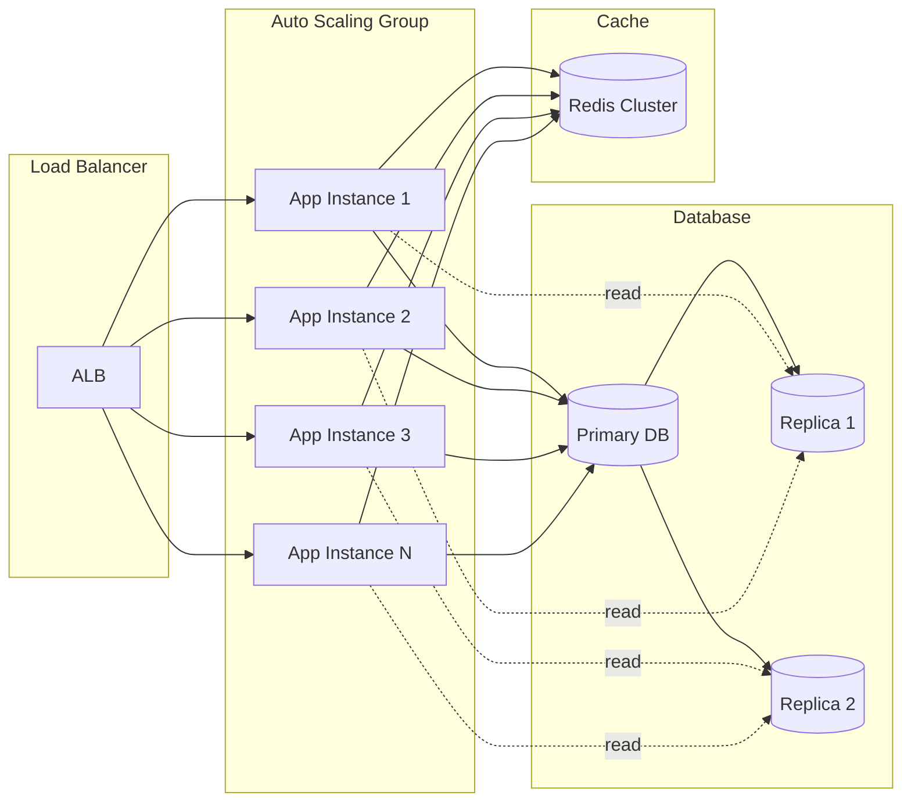

---

## Sécurité par Couche

| Couche | Mécanismes de Sécurité | Demos |
|--------|------------------------|-------|
| **Frontend** | HTTPS, CORS, CSP, XSS Protection | 1-19 |
| **API** | JWT, OAuth2, Rate Limiting | 5A, 5B, 17 |
| **Application** | RBAC, Input Validation, SQL Injection Protection | 6 |
| **Network** | VPC, Security Groups, Private Subnets | 14 |
| **Data** | Encryption at Rest (KMS), Encryption in Transit (TLS) | 14, 16 |
| **Secrets** | AWS Secrets Manager, Environment Variables | 14 |
| **DDoS** | AWS Shield, WAF, CloudFront | 14 |
| **Monitoring** | CloudWatch Alarms, Sentry Alerts | 15 |

---

## Coûts Estimés par Architecture

| Architecture | Coût Mensuel | Utilisateurs | Notes |
|--------------|--------------|--------------|-------|
| Demo 1 (Local) | $0 | Development | Gratuit |
| Demo 2 (+ AWS Bedrock) | $30-50 | Testing | IA réelle |
| Demo 3 (+ Neon) | $30-50 | < 100 | Free tier Neon |
| Demo 14 (Production) | $200-500 | 1000 | ECS + RDS + Bedrock |
| Demo 16 (Multi-tenant) | $500-2000 | 10,000 | Scale |
| Demo 19 (Enterprise) | $2000-5000 | 100,000 | Full scale |

---

## Métriques de Performance

### Objectifs par Niveau

| Metric | Demo 1-3 | Demo 14 | Demo 19 |
|--------|----------|---------|---------|
| Response Time | < 1s | < 500ms | < 200ms |
| Availability | 95% | 99.5% | 99.9% |
| Concurrent Users | 10 | 1,000 | 100,000 |
| Requests/sec | 10 | 1,000 | 10,000 |
| Database Size | 1 MB | 10 GB | 1 TB |

---

## Résumé de l'Évolution

```mermaid
timeline
    title Évolution de l'Architecture
    section Fondations
        Demo 1 : API REST + IA Local + Mémoire
    section Cloud
        Demo 2 : AWS Bedrock Réel
    section Persistance
        Demo 3-4 : PostgreSQL / Xata
    section Sécurité
        Demo 5-6 : Auth + RBAC
    section Features
        Demo 7-9 : S3 + Emails + Stripe + Exports
    section IA Avancée
        Demo 10-11 : RAG + pgvector + Multi-Agents
    section Production
        Demo 12-15 : Docker + CI/CD + AWS + Monitoring
    section Enterprise
        Demo 16-19 : Multi-tenant + API Public + React
```

---

**Auteur** : Haythem REHOUMA - Gneurone Inc.  
**Contact** : contact@gneuroneai.com  
**GitHub** : https://github.com/inskillflow

